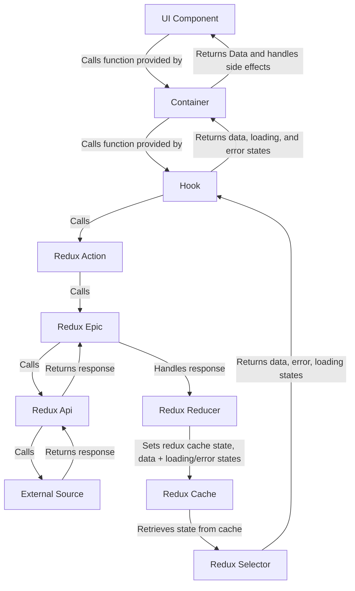

This section deals with how external data is retrieved, stored and accessed in the front end.

The following is a diagram on how to properly retrieve data from external sources:

The next documents will detail each leg of the redux journey.