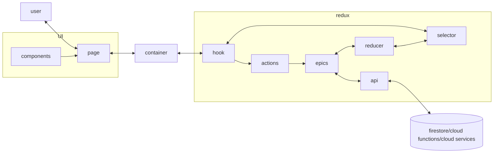

The following will explain the standard pattern for creating a new `page`. You will find some other designs in the dashboard which have been added over the years, however the following is the expected pattern going forwards. This can be extended to other components such as `widgets`. 

:::note
TODO: Standardise the entire dashboard to use this one (or improved) pattern going forwards.
:::

:::note
The pattern currently handles loading in the container. This can result in the entire page being covered by a loader. Passing down loading params could get messy, but a new per-component loader/error handler should be considered for user friendliness.
:::

## Diagram

:::note
Sometimes containers directly interface with `redux` if the use case is simple enough (Particularly if only selectors are involved and the relevant data has been retrieved beforehand)
:::

