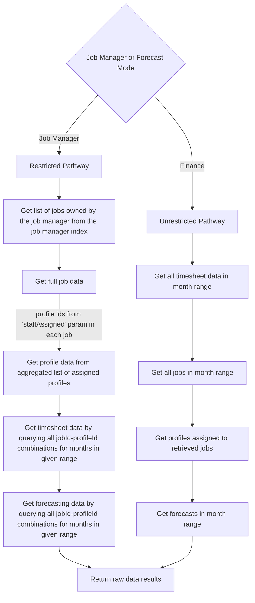

# Utilisation API

## Notes:

- Timesheet data is held, sorted by month, in the utilisation_analytics-months collection
- Restricted must query individually because firestore cannot have dynamic rules for LIST queries

## Is job in range calculation

- Is not in range if complete and has ended before the given start date 
- Is not in range if the job start date is after the given end date
- Is in range if not complete
