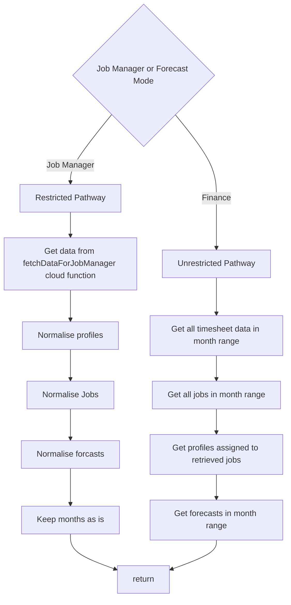

# Utilisation API

## Notes:

- Data is normalised in the front end so that the data structure can be changed without having to redeploy the cloud function
- Job managers call a cloud functions because dynamic firestore rules do not work with LIST requests. Therefore, a cloud function bypasses this rule (It validates via the user's jwt token) and can retrieve the data significantly more efficiently than individual GET requests, especially because the latter method requires querying each potential combination of JobId-ProfileId.

## Is job in range calculation

- Is not in range if complete and has ended before the given start date 
- Is not in range if the job start date is after the given end date
- Is in range if not complete

- For job managers, this filtering is done inside the cloud function.

:::warning
This means that if the `isJobInRange` function has to be changed, make sure **both** are changed.
:::
