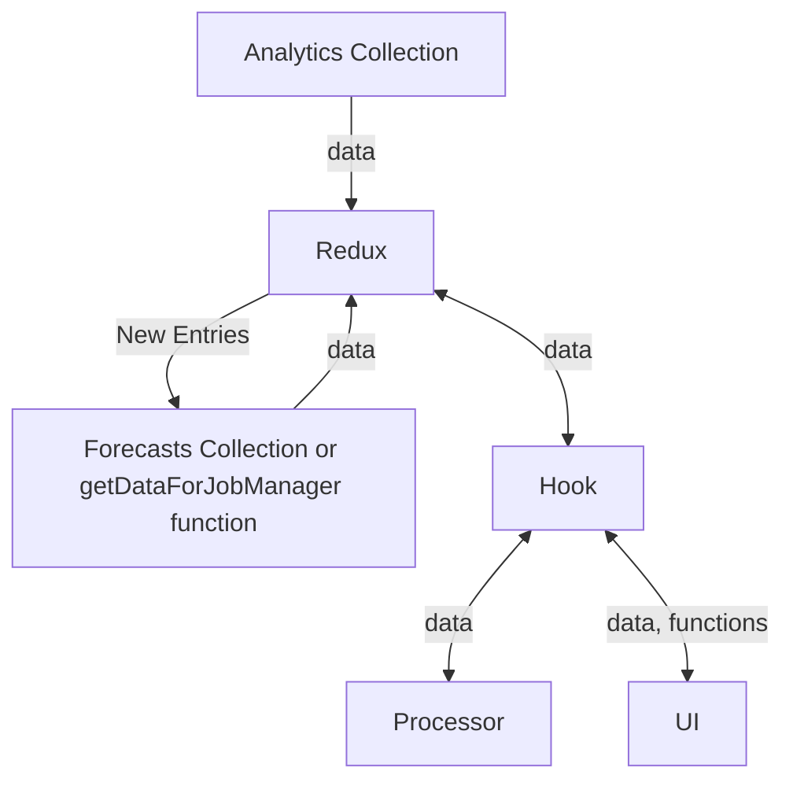

:::info
[Click Here](../../../pages/pages/Utilisation/overview.md) To see how the front-end UI works.

or

[Click Here](../../../cloud/Cloud%20Functions/Topics/utilisationanalytics.md) To see how the cloud function works.
:::

## Data Flow



## Consts

Consts (Such as the configuration for data processing etc.) `Are stored in redux/utilisation/utilisation.consts.js`

## Important Notes:

### Working Hour Calculations

Working hours are how many hours are available for a staff member to work taking into consideration weekends, holidays, and leave. It is calculated via the `syncStaffWorkingHoursOnSchedule` function. The holidays are retrieved via a third party API once a month via `syncHolidaysOnSchedule`.

```
workingHours = (8 * working days in month) - ( 8 * weekends in month) - ( 8 * non-weekend holidays) - ( total leave for month)
```

:::info
`workingHours` and `Available` are treated as synonyms (`Available` should be the terminology rendered in the UI)
:::

