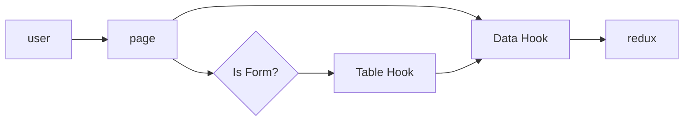

There are two travelplan systems. The first version - managed solely by `redux/travelplans/**` and the second version - using the `functions/flights` api.

The second version is currently not being used. It is intended to automate tracking and reduce manual input.

:::note
TODO: Replace v1 with v2 - this will require a redesign of the UI to accommodate the new structure. The cloud service uses zodd schema, which you can use to figure out the returns. 

The front end will need redux implementation, and some sort of plan for the firestore params.

TO DO LIST:

- collection for airports
- collection for airlines
- collection for itineraries
- collection for sensitive data (Keyed to itineraries)

- Redux API that takes in this data and handles side effects
  - Should handle loading states and errors for each collection 

- Dropdown components for airports, airlines
- Replicate features of v1 travelplans
- Design new UI to handle itinerary based travel plans vs flight based 
:::

## Flowchart 

## Collections

### travelplans v1

- pending_travelplans
- approved_travelplans

### travelplans v2

Adding 'travelplans' ensures they are all in the same place in the firestore collections panel

- travelplans
- travelplans-airlines
- travelplans-airports
- travelplans-flight-bookings
- travelplans-sensitive

