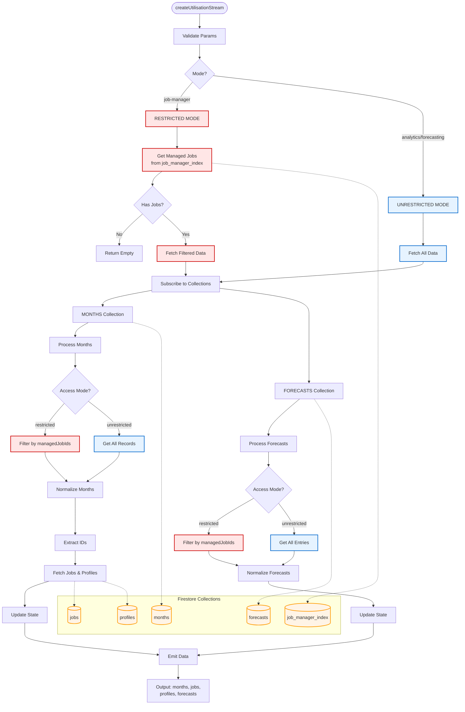

```mermaid
graph TB;
    Start([createUtilisationStream]) --> Validate[Validate Params]
    Validate --> ModeCheck{Mode?}

    ModeCheck -->|job-manager| Restricted[RESTRICTED MODE]
    ModeCheck -->|analytics/forecasting| Unrestricted[UNRESTRICTED MODE]

    %% RESTRICTED PATH
    Restricted --> GetJobs[Get Managed Jobs<br/>from job_manager_index]
    GetJobs --> HasJobs{Has Jobs?}
    HasJobs -->|No| Empty[Return Empty]
    HasJobs -->|Yes| FetchRestricted[Fetch Filtered Data]

    %% UNRESTRICTED PATH
    Unrestricted --> FetchAll[Fetch All Data]

    %% DATA FETCHING
    FetchRestricted --> Subscribe
    FetchAll --> Subscribe[Subscribe to Collections]

    Subscribe --> MonthsSub[MONTHS Collection]
    Subscribe --> ForecastSub[FORECASTS Collection]

    MonthsSub --> ProcessMonths[Process Months]
    ForecastSub --> ProcessForecasts[Process Forecasts]

    ProcessMonths --> GetRecords{Access Mode?}
    GetRecords -->|restricted| FilterRecords[Filter by managedJobIds]
    GetRecords -->|unrestricted| AllRecords[Get All Records]

    FilterRecords --> NormMonths[Normalize Months]
    AllRecords --> NormMonths

    NormMonths --> ExtractIds[Extract IDs]
    ExtractIds --> FetchJP[Fetch Jobs & Profiles]
    FetchJP --> UpdateState1[Update State]

    ProcessForecasts --> GetEntries{Access Mode?}
    GetEntries -->|restricted| FilterEntries[Filter by managedJobIds]
    GetEntries -->|unrestricted| AllEntries[Get All Entries]

    FilterEntries --> NormForecasts[Normalize Forecasts]
    AllEntries --> NormForecasts
    NormForecasts --> UpdateState2[Update State]

    UpdateState1 --> Emit[Emit Data]
    UpdateState2 --> Emit

    Emit --> Output[Output: months, jobs,<br/>profiles, forecasts]

    %% FIRESTORE
    subgraph Firestore[Firestore Collections]
        JMI[(job_manager_index)]
        Months[(months)]
        Forecasts[(forecasts)]
        Jobs[(jobs)]
        Profiles[(profiles)]
    end

    GetJobs -.-> JMI
    MonthsSub -.-> Months
    ForecastSub -.-> Forecasts
    FetchJP -.-> Jobs
    FetchJP -.-> Profiles

    %% STYLING
    classDef restrictedClass fill:#ffe6e6,stroke:#c00,stroke-width:2px
    classDef unrestrictedClass fill:#e6f3ff,stroke:#06c,stroke-width:2px
    classDef dbClass fill:#fff4e6,stroke:#f90,stroke-width:2px

    class Restricted,GetJobs,FetchRestricted,FilterRecords,FilterEntries restrictedClass
    class Unrestricted,FetchAll,AllRecords,AllEntries unrestrictedClass
    class JMI,Months,Forecasts,Jobs,Profiles dbClass
```
