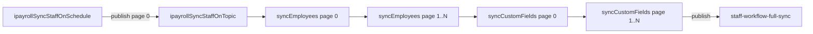
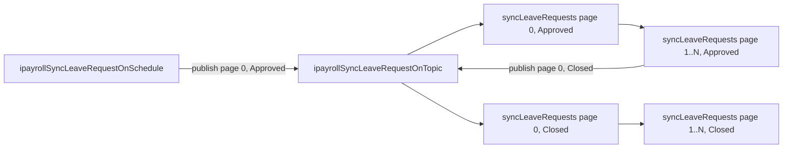
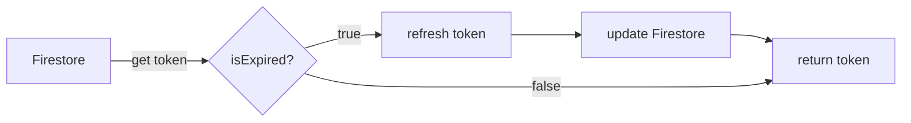

# iPayroll

iPayroll has 6 topics divided into two categories: `SyncStaff` and `SyncLeaveRequest`. These hit different entry points of the iPayroll API.

> **Important:** Nonprod and prod functions are offset by 10 minutes. This ensures that they do not hit the same API token at the same time. As everything is sequential, the API should only be hit at most 2-3 times at once (max is 5). This is because there can be some overlap between the employee and leave-request sync.

> **Warning:** Currently, all iPayroll syncs conclude well within 10 minutes. If the data expands significantly, this could become an issue as the syncs would overlap. Either increase the offset, or optimise the sync functions.

### SyncStaff

- `ipayrollSyncStaffOnSchedule`
- `ipayrollSyncStaffOnTopic`

### SyncLeaveRequest

- `ipayrollSyncLeaveRequestOnSchedule`
- `ipayrollSyncLeaveRequestOnTopic`

---

## Relevant Files

`function.sync.[category]`
Calls the `sync[category]()` function from `service.[category].sync` at the given time periods.

`service.sync.[category]`
Co-ordinates the fetch, hash check, and processing of the request.

`service.transform`
The `transform[category]Response` function picks fields from the iPayroll API. Edit this to change which fields are synced to Firestore.

`[category].client.api`
Sets up the interceptors. `service.oauth.ipayroll` manages token retrieval and refreshing.

---

## Timeline

### Employees

The schedule publishes page 0 to the topic. The topic handler then loops all remaining pages **sequentially within a single invocation** — Custom fields sync runs in the same invocation after all employee pages are complete

- WorkflowMax staff sync pub/sub is sent to append wfm data to the `profile` collection.

#### Employee sync logic (`service.employees.sync`)

Each page of employees is processed as follows:

1. **Fetch** — retrieve the given page of employees from iPayroll.
2. **Hash check** — if the page content is unchanged since the last sync, skip processing entirely (early exit).
3. **Upsert** — for each employee, if a matching Firestore profile exists (matched by email), overwrite it while preserving any existing `workflowId` and `practice` fields. If no profile exists, create a new one.
4. **Removals** — staff present in Firestore with an `ipayrollId` but absent from the current iPayroll page are handled in one of two ways:
   - **Delete** — if the record has no `workflowId`, the Firestore profile is deleted entirely.
   - **Strip** — if the record has a `workflowId` (i.e. they still exist in WorkflowMax), the profile is reduced to a minimal field set (`email`, `displayName`, `practice`, `ipayrollId`, `mobile`, `title`, `workflowId`) rather than deleted.

#### Custom fields sync logic (`service.customfields.sync`)

Custom fields (e.g. `contractEndDate`) are synced onto existing staff profiles after all employee pages have been processed. Each page is handled as follows:

1. **Fetch** — retrieve the page of custom fields from iPayroll.
2. **Hash check** — skip if unchanged.
3. **Look up** — retrieve relevant staff from Firestore by `ipayrollId`.
4. **Merge** — apply custom field values (e.g. `contractEndDate`) onto the existing profile using `merge: true`, so no other profile fields are overwritten.

---

### Leave Requests

Approved and Closed leave requests are processed one after the other **within a single invocation**. All pages of a given status are looped sequentially before moving to the next status.

---

## Interceptors

Found in `ipayroll.api.client.js`. This creates an `axios` instance that retrieves a new token for every request made, rather than fetching the token once at function start and passing it down. This ensures every request uses a fresh token.

If a request fails with a 401, it will attempt to fetch a new token. This handles cases where the token becomes invalidated due to rate limits being hit, which would otherwise leave it un-refreshed within its lifetime.

### getCurrentToken

Found in `service.oauth.ipayroll.js`. Handles refreshing the token when expired.

**Expiry conditions:**

- Tokens have a 5-minute lifetime (hardcoded — the refresh token provides 10 minutes till expiry, but this is unreliable in practice).
- Token is also considered expired if under 2 minutes remain in its lifetime.
