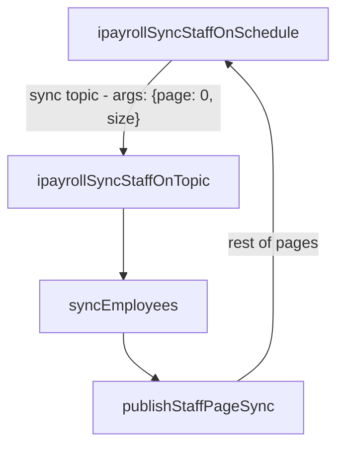
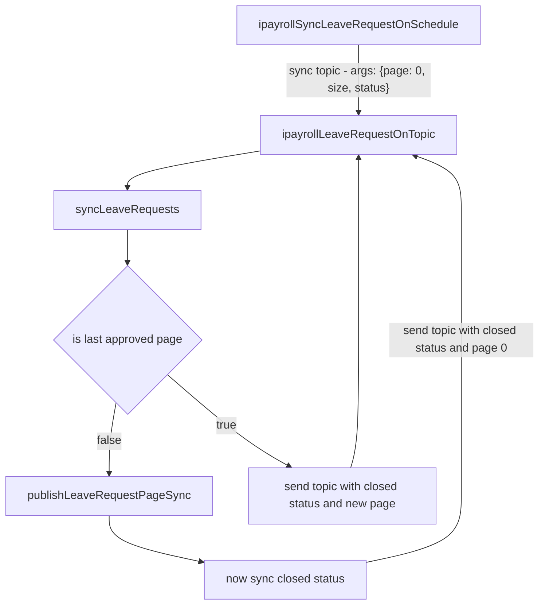
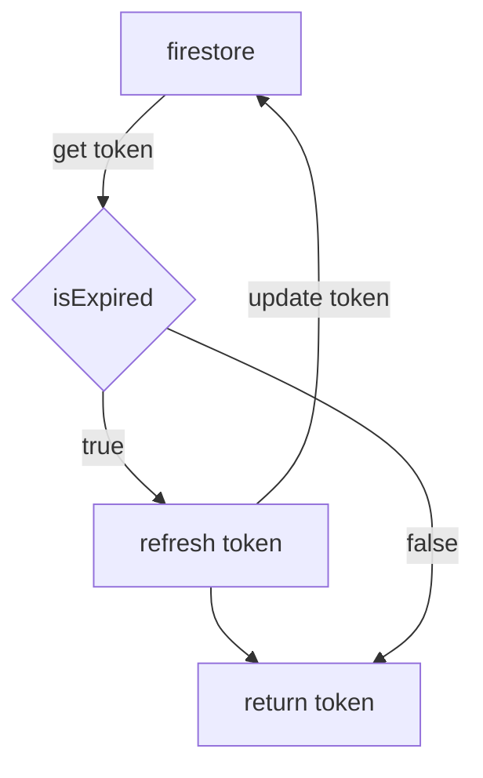

# iPayroll

iPayroll has 6 topics divided into two categories: `SyncStaff`, and `SyncLeaveRequest`. These hit different entry points of the ipayroll `api`.

  

    ### SyncStaff

    - `ipayrollStaffOnTopic` 
    - `ipayrollSyncStaffOnScheduleWeekdayFifteenMinute` 
    - `ipayrollSyncStaffOnScheduleWeekdayHour`
    - `ipayrollSyncStaffOnScheduleWeekendHour`
  

  
  

    ### SyncLeaveRequest

    - `ipayrollSyncLeaveRequestOnTopic` 
    - `ipayrollSyncLeaveRequestOnScheduleWeekdayFifteenMinute` 
    - `ipayrollSyncLeaveRequestOnScheduleWeekdayHour`
    - `ipayrollSyncLeaveRequestOnScheduleWeekendHour`
  

## Relevant files

#### function.sync.[category]

Calls the `sync[category]()` function from `service.[category].sync` at the given time periods.

#### service.sync.[category]

Co-ordinates the fetch, hash check, and processing of the request.

#### service.transform'

The `transform[category]Response` function picks fields from the iPayroll API. Edit this to change fields synced to firestore.

# Timeline

## Employees

## Leave Requests

The goal here is to sequentially hit the ipayroll database to avoid rate limits. 

- publishLeaveRequestPageSync will publish a sync topic every 5 seconds (It takes ~3 seconds to sync 100 items).
- Approved and closed leave requests are done one after the other, not at the same time.

# Interceptors

Found in `ipayroll.api.client.js` This creates an `axios` instance, which will retrieve a new `token` for every `request` 
made, instead of getting the token at the start of the function and passing it down. This ensures that every request is 
made with a fresh token.

If this request fails due to 401, it will attempt to get a new token. This is because the token can become invalidated if rate limits are
hit, and the token will not be refreshed otherwise if it has not hit its lifetime.

## getCurrentToken

Found in `service.oauth.ipayroll.js` this handles refreshing the token when expired. 

Expiry conditions:
- Tokens have a 5 minute liftime (hardcoded as refresh token provides 10 minutes till expiry - which is false)
- Under 2 minutes till lifetime end.
