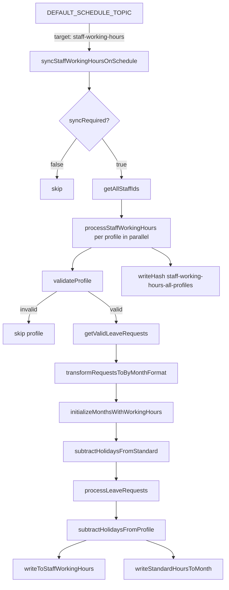
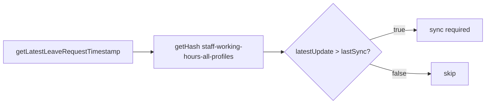
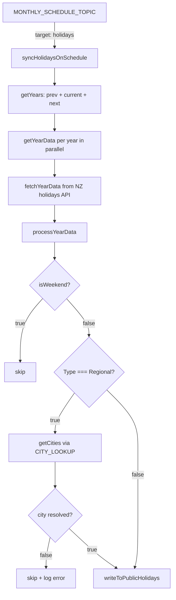

# Working Hours

Working hours has two topics: `SyncStaffWorkingHours` and `SyncHolidays`. Both listen on shared schedule topics rather than their own dedicated pub/sub topics.

:::info
Both functions listen on shared schedule topics (`DEFAULT_SCHEDULE_TOPIC` and `MONTHLY_SCHEDULE_TOPIC`) alongside other functions. A `target` field in the message payload is used to filter — if `target` is present but does not match, the function exits early without processing.
:::

---

## Relevant Files

`function.working-hours.js`
Defines both schedule-triggered Cloud Functions and handles the `target` filtering logic.

`service.sync.workingHours.js`
Co-ordinates the staff working hours sync — timestamp comparison, per-profile processing, leave subtraction, and holiday subtraction.

`service.sync.holidays.js`
Fetches public holidays from the NZ public holidays API and writes them to Firestore. Processes previous, current, and next year.

`holidays/consts.js`
Defines `CITY_LOOKUP` — a map used to derive which cities are affected by a regional holiday based on the holiday name.

`utils.tools.js`
Shared date utilities: `isWeekend`, `formatDate`, `getMonthKey`, `countWeekendsInMonth`, `parseCustomDate`, `findDateRange`, `ensureNonNegativeHours`.

`utils.validators.js`
Validates staff profiles and leave requests. Converts leave date strings (`DD-MMM-YYYY`) to JavaScript `Date` objects and filters out any invalid entries.

---

## Timeline

### Staff Working Hours

Before processing any profiles, a timestamp comparison is performed against the last sync hash. If no approved leave requests have been updated since the last sync, the entire run is skipped.

All profiles are then processed in parallel. Each profile's working hours are calculated by starting from general working hours (all weekdays in the month × 8h), then subtracting leave and applicable public holidays.

- A profile requires both `ipayrollId` and `workflowId` to be processed — profiles missing either are skipped.
- Leave requests are validated and filtered before use. Invalid date formats or illogical date ranges are logged and excluded.
- Holidays are only subtracted on days not already covered by leave, to avoid double-counting.

#### Working hours calculation

For each profile the monthly working hours are derived in four steps:

1. **Initialise** — for each month in the date range, start with `(working days in month) × 8h`. Working days excludes weekends.
2. **Subtract national holidays** — for `standardHoursByMonth`, subtract 8h per national public holiday that falls on a weekday. Regional holidays are excluded from the standard.
3. **Subtract leave** — for each approved leave day (weekdays only), subtract 8h from the profile's month. Each calendar date is only subtracted once, even if multiple leave requests overlap.
4. **Subtract applicable holidays** — subtract 8h per holiday not already covered by leave. National holidays apply to all profiles; regional holidays only apply if the profile's city is in the holiday's `cities` array.

#### `isSyncRequired`

---

### Holidays

Fetches public holidays from the NZ public holidays API for the previous, current, and next year. Years are processed in parallel. Each year's data is validated and written to Firestore. Non-critical errors (e.g. a single year failing to fetch) are logged but do not abort the overall sync.

- Weekend holidays are skipped — they have no effect on working hours.
- Regional holidays are mapped to cities via `CITY_LOOKUP` in `consts.js`. If a regional holiday name cannot be matched to any city, it is logged and skipped.

#### City lookup (`holidays/consts.js`)

Regional holidays are matched to cities by checking whether the holiday name contains any of the `includes` terms defined in `CITY_LOOKUP`. A single holiday can map to multiple cities — for example, a Wellington Anniversary holiday also applies to Palmerston North.

| Key | City | Matched by |
|---|---|---|
| `WELLINGTON` | Wellington | `wellington` |
| `PALMERSTON_NORTH` | Palmerston North | `wellington`, `palmerston north` |
| `CHRISTCHURCH` | Christchurch | `canterbury`, `christchurch` |
| `AUCKLAND` | Auckland | `auckland` |

---

## Validators

### `validateProfile`

Checks that a staff profile has both `ipayrollId` and `workflowId`. Profiles missing either field are skipped and the error is logged against the profile ID.

### `getValidLeaveRequests`

Fetches approved leave requests for a given `ipayrollId` and validates each one:

1. Date strings must match `DD-MMM-YYYY` format (e.g. `25-Dec-2025`).
2. Both `leaveFromDate` and `leaveToDate` must parse to valid `Date` objects via `parseCustomDate`.
3. `leaveFromDate` must not be after `leaveToDate`.

Invalid requests are filtered out and logged. Valid requests are returned with date strings converted to JavaScript `Date` objects.
