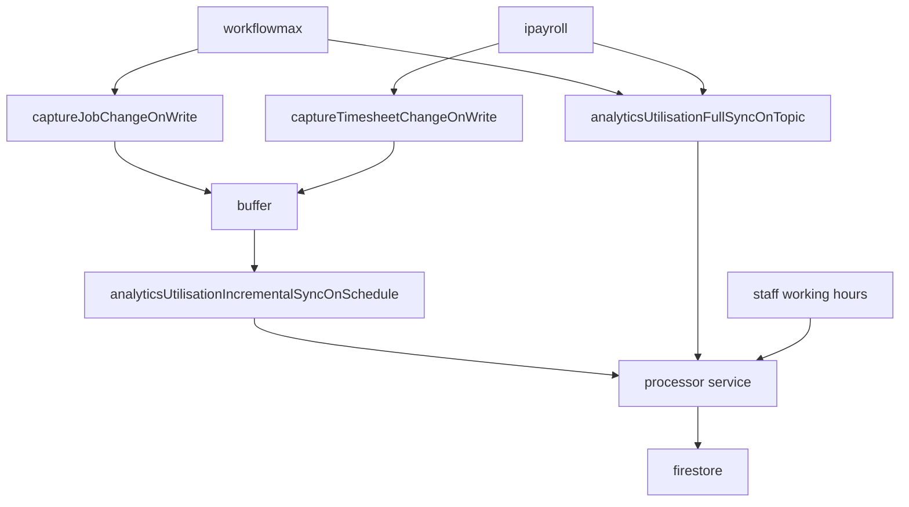

:::warning
Incremental sync works on delta data (To reduce processing). Therefore, if anything happens to the buffer, it can go out of sync. If doing a full sync,
ensure that the buffer is clear.
:::

## Collections

### utilisation-forecasts

Contains user input forecast data

### utilisation-analytics-buffer

Contains changed data from jobs/timesheets

### utilisation_analytics-jobs

Contains relevant job data (Main addition is total hours per job)

### utilisation_analytics-months

Contains hour data for each user_job entry by month (In a subcollection for data protection)

### utilisation_analytics-profiles

Contains normalised profile data (Departed profiles are no longer in profiles, but have rudimentary data in times/jobs. This prevents gaps in historical data)

### utilisation_analytics-job_manager_index

Can be freely accessed by job managers, allows them to get a list of what jobs they manage without leaking important data.

