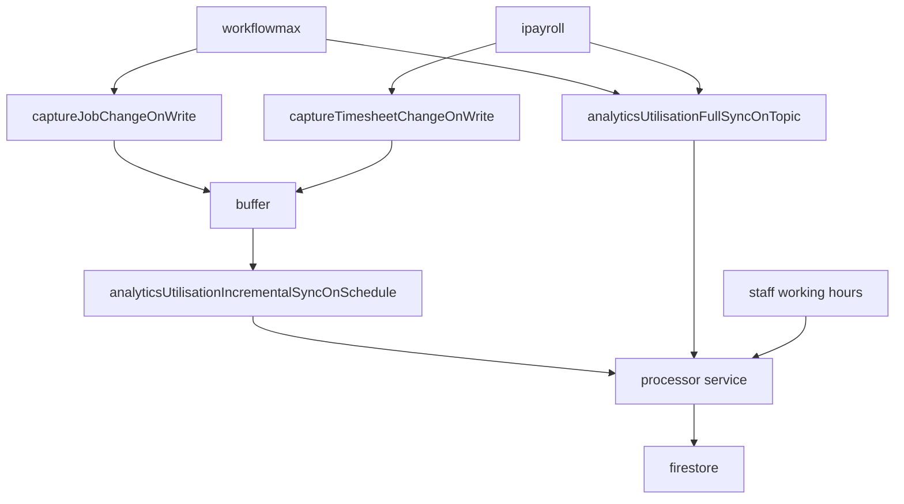

:::warning
Incremental sync works on delta data (To reduce processing). Therefore, if anything happens to the buffer, it can go out of sync. If doing a full sync,
ensure that the buffer is clear.
:::

## Collections

#### utilisation-forecasts

Contains user input forecast data

#### utilisation-analytics-buffer

Contains changed data from jobs/timesheets

#### utilisation_analytics-jobs

Contains relevant job data. Importantly, it also includes:

- Total hours for the jobs as a whole
- A list of all wfm ids for staff that have ever been assigned to the job, or have submitted timesheets for the job

#### utilisation_analytics-months

Contains hour data for each user_job entry by month

- At the top level is a document for each YYYY-MM with data
- For each document there is a sub-collection called `records` containing all jobId-profileId documents for that month. These documents contain timesheet hour data.

#### utilisation_analytics-profiles

Contains normalised profile data from the `times` and `profile` collection. Departed profiles are removed from `profile`, which can cause gaps in the data - this prevents that.

#### utilisation_analytics-job_manager_index

Can be freely accessed by job managers, allows them to get a list of what jobs they manage without leaking important data. This is necessary because rbac uses the `email` field in the jwt token to secure `months` and `jobs` data, thus this collection relates emails to job-managers.

## How syncing works

There are two ways that the analytics sync, `fullsync` and `incrementalsync`. `fullsync` can only be called manually via a `pub/sub` while `incrementalsync` takes entries in the `buffer` on schedule, calculates the data delta for each entry and syncs them to the database. This is done to save on compute.

The following is how `fullsync` works as it provides the most complete view of how the data is strutured:

### Step 1: Pull jobs

Jobsv2 (wfm v2 api) is the source of truth for which jobs are included or excluded. Jobsv2 is a complete list of jobs from wfm with data not found in jobsv1 (i.e staffAssigned).

- This is also where a map of `total aggreggated profiles` is initialised

### Step 2: Process each job

1. Get timesheet data for job from `times` collection.
2. Get hours data from timesheets
3. Get `aggregated profiles` from `timesheets` and `staffAssigned`. This is a set of every staff member that has ever entered a timesheet or been assigned to a `job`. This is to be written to the `job` in firestore.
4. Calculate total `job` hours. This is to be written to the `job` in firestore.
5. Write `job` to firestore
6. Write `months (timesheets)` to firestore
 - For each month document in `months`, write a document in the `records` subcollection containing `hours` data for a given `jobId` and `profileId` combination.

:::info
The above writes are done to the utilisation*analytics*[months/job/job-manager] collections as appropriate
:::

### Step 3: Write total aggregated profiles

- To the utilisation_analytics-profiles collection in firestore.

## Front end

[Go Here]('../../../../../pages/pages/Utilisation%20Forecasting/overview.md') For how the front-end uses this data
