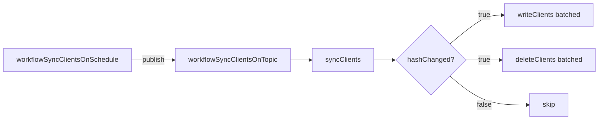
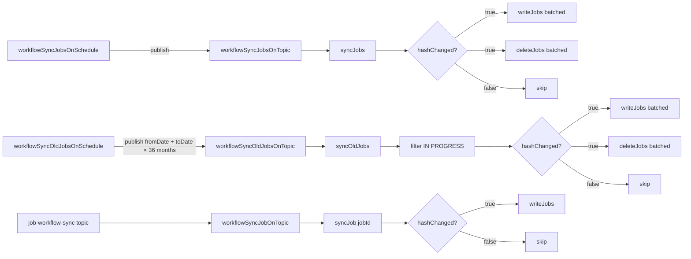
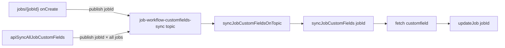
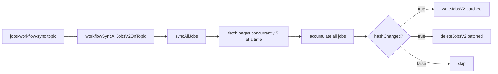
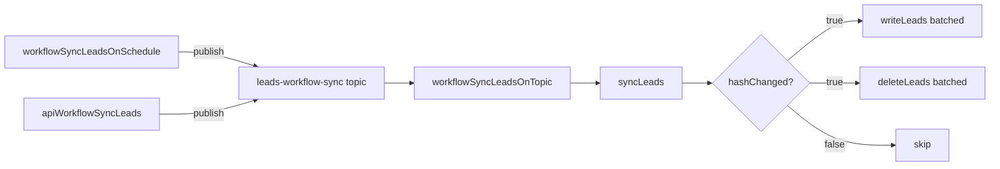
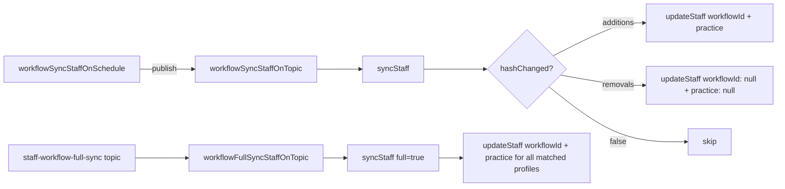
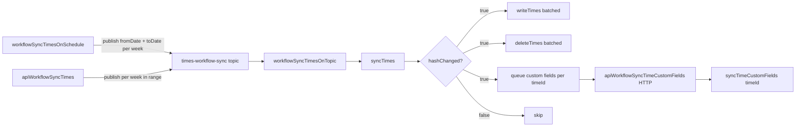
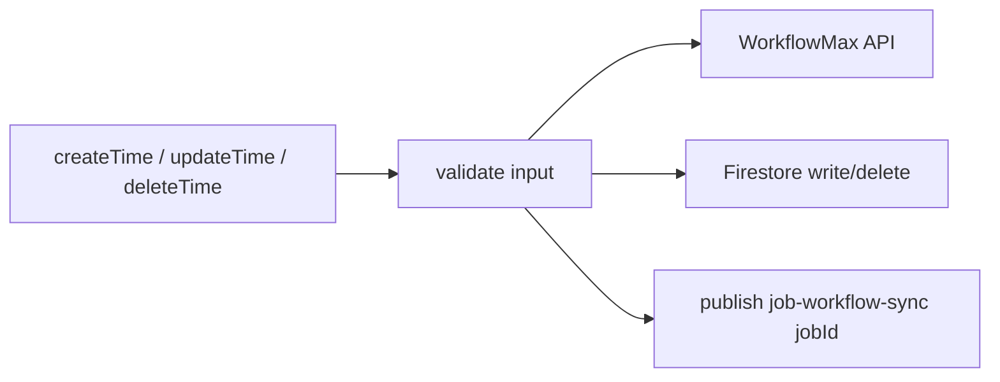
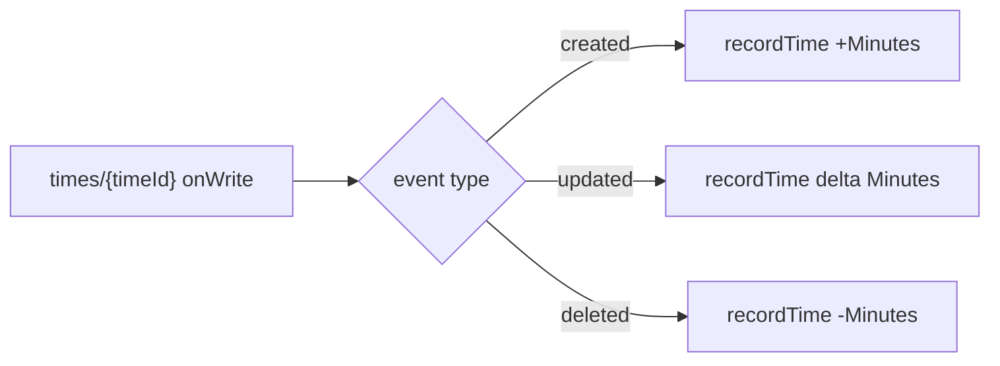
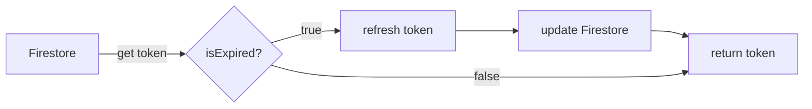

# WorkflowMax

WorkflowMax has topics divided into six categories: `Clients`, `Jobs`, `JobsV2`, `Leads`, `Staff`, and `Times`. These hit different entry points of the WorkflowMax API.

:::info
There are two API clients — a v1 client (`workflowApiClient`) using the XML-based API, and a v2 client (`workflowApiClientV2`) using the JSON-based REST API. Both attach a fresh OAuth token on every request via a request interceptor.

v2 provides more information - but its data needs to be transformed to be used for legacy systems. It is currently only used for the new
forecasting system.
:::

---

## Relevant Files

`function.[category].sync.js`
Defines the schedule and topic-triggered Cloud Functions for each category.

`service.[category].sync.js`
Co-ordinates the fetch, hash check, and Firestore write/delete logic for each category.

`service.transform.js`
Contains `transform[Category]Response` functions that shape the WorkflowMax API response into Firestore documents. Edit these to change which fields are synced.

`workflow.api.client.js`
Exports `workflowApiClient` (v1, XML) and `workflowApiClientV2` (v2, JSON). Both use a request interceptor to attach a fresh Bearer token and account ID on every request. `service.oauth.workflowmax` manages token retrieval and refreshing.

---

## Timeline

### Clients

Fetches all clients in a single request and runs a hash check. Writes new/changed clients and deletes removed ones in batches.

---

### Jobs

Two separate schedules exist — one for current jobs and one for old jobs covering the last 36 months. A single-job sync is also available via topic, triggered by the time entry service after a time is created or updated.

- Old jobs are published sequentially with a 250ms delay between each month to avoid overloading the API.
- Old jobs filter out any jobs still `IN PROGRESS`, as only completed jobs are relevant for historical sync.

#### Job Custom Fields

Custom fields are synced per-job, triggered either on Firestore document creation or via a callable API that fans out across all job IDs.

:::info
Custom fields are not triggered on job **update** to avoid infinite loops.
:::

:::tip
TODO: In the future, it might be a good idea to save a hash and update if the hash has changed. Allowing for **update** triggers.
:::

---

### Jobs V2

Uses the v1 `jobs-workflow-sync` topic, and runs concurrently alongside the v1 sync. Fetches all jobs from the v2 REST API in paginated batches of 5 concurrent pages, accumulates the full result set, then performs a single hash check before writing. Only changed, new, or removed records are written to Firestore.

---

### Leads

Fetches all current leads in a single request and runs a hash check. Writes and deletes in batches. `apiWorkflowSyncLeads` is a callable function that triggers an on-demand sync.

---

### Staff

Staff sync operates in two modes — **standard** and **full**.

- **Standard** — hash-checked. Only processes additions (appending `workflowId` and `practice` onto existing iPayroll profiles) and removals (nulling out `workflowId` and `practice` rather than deleting the profile).
- **Full** — skips the hash check and overwrites `workflowId` and `practice` on every matched profile unconditionally. Triggered automatically by the iPayroll staff sync on completion.

Staff records are matched to Firestore profiles by email. There are hardcoded email normalisations for known inconsistencies in WorkflowMax data.

:::tip
TODO: This should be changed to only be triggered by the ipayroll sync. This is because currently, it is being run twice over, which is innefficient.
:::

---

### Times

Times are synced by week. Three schedules cover different ranges, and a callable function allows arbitrary date range syncs. After a sync, custom fields are queued for each added time record via a separate HTTP endpoint.

| Schedule | Weeks covered |
|---|---|
| `workflowSyncTimesWeekOnSchedule` | Current week only |
| `workflowSyncTimesOnSchedule` | Next week + previous 3 weeks |
| `workflowSyncTimesOldOnSchedule` | Weeks 5–10 (previous month) |

#### Time Mutations (`service.time.js`)

Time entries can be created, updated, and deleted directly. Each mutation writes to both WorkflowMax and Firestore, then triggers a re-sync of the affected job.

- `createTime` checks for an existing matching entry (same job/staff/task/date) and uses an idempotency collection to prevent duplicate creation under concurrent calls.

#### Time Analytics (`function.time.analytics.js`)

A Firestore `onWrite` trigger on `times/{timeId}` maintains a separate analytics collection by recording minute deltas on create, update, and delete.

---

## Interceptors

Found in `workflow.api.client.js`. Two `axios` instances are configured — `workflowApiClient` for the v1 XML API and `workflowApiClientV2` for the v2 JSON API. Both attach a fresh Bearer token and account ID on every request rather than fetching the token once at function start.

### getCurrentToken

Found in `service.oauth.workflowmax.js`. Handles refreshing the token when expired.

