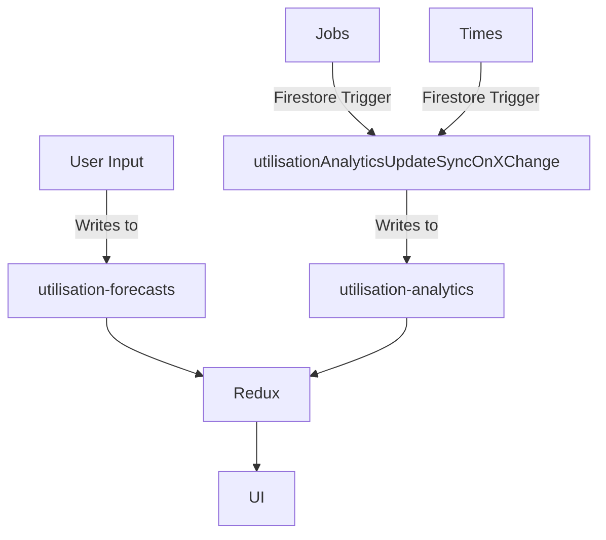

The cloud system for forecasting has its own tab as it is unique compared to the other cloud functions and services.

The cloud function that syncs jobs and times into utilisation-analytics works off of a list of jobs. This could be a problem because it doesn't fully reflect the actual time sheet data, it may exclude certain jobs. Therefore, a complete list of jobs (from v2) is required.



## utilisation-analytics collection

Structure:

```
utilisation-analytics
> month
>> byJob
>>> Job
>> byProfile
>>> Profile
>> company-totals
>> metadata
```

### byJob subcollection

Job document structure

```
jobId: {
    updatedAt: NUMBER,
    name: STRING,
    clientManagerUUID: STRING,
    dueDate: STRING (YYYY-MM-DD),
    estimatedHours: NUMBER,
    isCompleted: BOOLEAN,
    jobId: STRING,

    client: {
        ID: UUID
        Name: STRING
    },
    totalHours: {
        billable: NUMBER,
        nonBillable: NUMBER,
        percentageBillage: NUMBER,
        total: NUMBER
    },
    profiles: [
        {
            billableRate: NUMBER,
            name: STRING,
            practice: STRING,
            profileId: NUMBER,
            totalHours: {
                billable: NUMBER,
                nonBillable: NUMBER,
                percentageBillage: NUMBER,
                total: NUMBER
            },
            tasks: [
                {
                    hours:{
                        billable: NUMBER,
                        nonBillable: NUMBER,
                        percentageBillage: NUMBER,
                        total: NUMBER
                    },
                    isBillable: BOOLEAN,
                    taskId: STRING
                    taskInfo: {
                        ID: STRING,
                        Name: STRING
                    }
                }
            ]
        }
    ]
}
```

### byProfile subcollection

Profile document structure

```
workflowId: {
    month: STRING (YYYY-MM),
    name: STRING,
    practice: STRING,
    profileId: STRING (workflowId),
}
```
