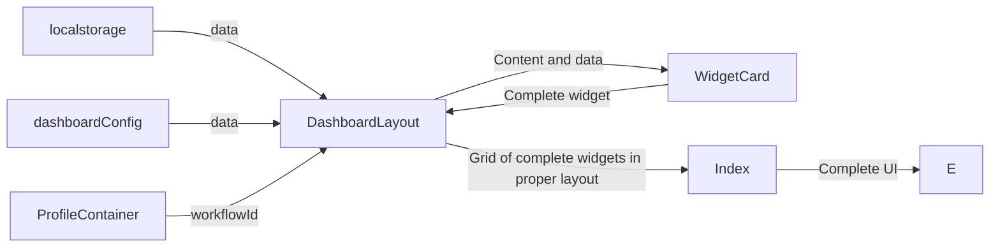

## Overview

This page handles rendering the widget configuration in the `home` page based on data in the `local storage`. Eventually there should be better enforced separation of concern and what constitutes a `widget`'s content.

## DashboardLayout

This component handles retrieving the relevant data from the `local storage`. It then renders a `WidgetCard` for each `widgetConfig` in the `local storage` layout. The `contents` of the `WidgetCard` is retieved by matching the widget `type` and returning the relevant widget `component`.

This isn't the most accurate diagram in a technical sense, but it gives a general idea of the flow of data and rendering.

## GetWidget

Returns a `component` based on the widget type. To add new widgets to `render`, `import` the `component` and add it to the `switch` stack. There is currently no standard on what constitutes a widget's content.