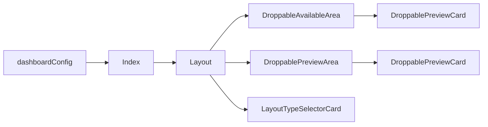

## Overview

This page handles the user configuration of the dashboard widgets. It uses dnd-kit to handle dragging and dropping components, which edits the local storage, changing what widgets are displayed on the dashboard and in what layout. 

There are 4 key components to this page:

- `DroppablePreviewCard` A placeholder widget card that can be dragged and dropped between droppable areas.

- `LayoutTypeSelectorCard` A card with buttons that allow you to change and reset layouts.

- `DroppableAvailableArea` An accordion holding `DroppablePreviewCard`s that are available for use.

- `DroppablePreviewArea` A set of columns based on the selected layout that holds dropped `DroppablePreviewCard`s. The user can: 
    - Re-arrange `DroppablePreviewCard`s between and within the columns
    - Drag new `DroppablePreviewCard`s from the `DroppableAvailableArea`
    - Remove `DroppablePreviewCard`s from a column, returning them to the `DroppableAvailableArea`.

Additionally is the `dashboardConfig` which handles configuring the dashboard widget system as a whole e.g:
- Individual widget configs
- Layouts
- Local storage directories

## Data flow diagram

## Index

Most of the logic managing the drag and drop system as well as the data initialisation is handled in various functions in the Index component and passed on to the `Layout` component. 

:::warning 
Ideally, components down the stream should not be generating their own data. 

e.g the `LayoutTypeSelectorCard` doesn't have its own functions to change the relevant localstorage fields, it calls a function passed to it that originates from Index.
:::

## Key functions

- `handleRemove` Removes a given item from a given column, adjusting the `droppedItems` and `availableItems` fields as suits.

- `handleResetLayout` Resets all layout data in the local storage and in `availableItems`.

- `handleDragEnd` The most important function. It handle what occurs when you `drop` a dragged item.
    - It will prioritise dropping onto a column and ignore if a widget overlaps with that location (Otherwise it gets blocked by widgets and the column is not detected).
    - Handles moving between and within a column.
    - Handles dropping between `preview` and `available` areas.

