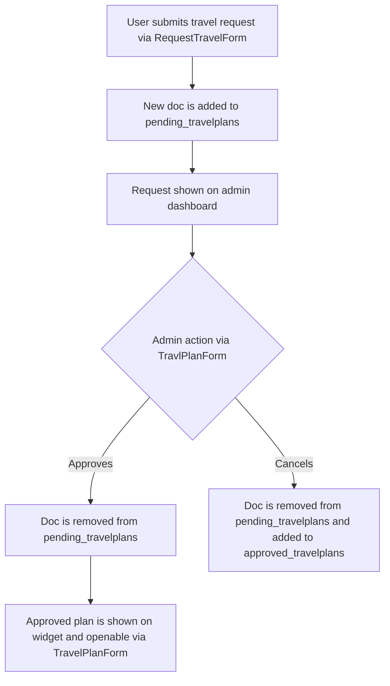
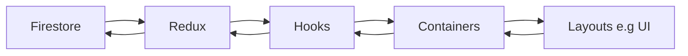

# Travel Plans

## TO DO:

- Make it send an email to a designated admin when travel plans are submitted
- Dialog to show details for what pending plans an individual has (the data is already there)
- Can edit approved plans (in case of incorrect info)
- Can see travel plans in user profile
- Travelplan history

## Overview

This is a widget where users can:

- Submit requests to travel
- See approved travel plans (And as such where people are going)
- See how many pending travel plans they have

Admins can access a dashboard via the widget to:

- See a list of pending travel plans, fill out technical details and either approve or cancel them.
- See a list of approved plans

Admins cannot

- Edit, approve, or cancel their own plans

## Relevant Files

#### Widgets

- TravelPlansWidget

#### Pages

- travelplans/
- travelplans/detail?={id}
- travelplans/admin
- travelplans/admin/approve?={id}
- travelplans/admin/edit?={id}
- travelplans/manage
- travelplans/request/
- travelplans/request/detail?={id}
- travelplans/request/edit?={id}

#### Components

- TravelPlanForm (For creating, editing, and viewing approved travelplans)
- RequestTravelForm (For creating, editing, and viewing pending travelplans)
- AirportCityHandler (A hashmap of CITY:AIRPORT key values)

#### Containers

- PendingTravelPlansContainer
- ApprovedTravelPlansContainer

#### Hooks

- useApprovedTravelPlans
- usePendingTravelPlans

#### Redux

- travelplans.epics
- travelplans.reducer
- travelplans.selectors
- travelplans.api

## Data flow

Data is stored in two firebase collections.

The flow is:



### travelplans

Document structure

#### Approved

```json
{
    //meta info
    approvedAt:date
    createdAt:date
    userId:stirng
    status:string
    //General details
    general:{
        isReturning:bool
        notes:string
        reason:stirng
        reference:string
    }
    //Flight 1
    origin:{
        airline:string
        date:string
        arriving:{
            airport:string
            city:string
            time:string
        }
        departing:{
            airport:string
            city:string
            time:string
        }
    }
    //Flight 2
    returning:{
        airline:string
        date:string
        arriving:{
            airport:string
            city:string
            time:string
        }
        departing:{
            airport:string
            city:string
            time:string
        }
    }
}
```

#### Approved

```json
{
    //meta info
    createdAt:date
    userId:stirng
    email:string
    //General details
    general:{
        isReturning:bool
        notes:string
        reason:stirng
        requiresAccommodation:string
    }
    //Flight 1
    origin:{
        date:string
        arriving:{
            city:string
        }
        departing:{
            city:string
        }
    }
    //Flight 2
    origin:{
        date:string
        arriving:{
            city:string
        }
        departing:{
            city:string
        }
    }
}
```

## Security

Security is handled through firestore rules.

- Only `admin`s and `superadmin`s can write to approved_travelplans (the user owner can edit their pending plan)
- Only `admins`s, `superadmin`s and the travelplan's user can view data in the `sensitive` subcollection

Everyone can `read` all travelplans, but an attempt to access the `sensitive` subcollection without the correct permissions will result in the silent failure of retrieving that data. The rest of the collection can still be retrieved.

```js
     match /travelplans/{doc} {
      allow read; //anyone can read non-sensitive info

      allow write: if isAdmin()
      // Subcollection for sensitive data
      match /sensitive/{sensitiveDoc} {
        // Only admins and plan owners can read sensitive data
        allow read: if isAdmin() ||
                      request.auth.token.email == get(/databases/$(database)/documents/travelplans/$(doc)).data.email;
        allow write: if isAdmin();
      }
    }
```

## Flow

#### User
```mermaid
graph TD:
    A[Widget]--> B1[List]
    B1--'Click ListItem'-->B2[Approved Travelplan details]
    A--> B2[My Travel List]
    B2--'RequestTravel'-->C2[Fill out RequestTravelForm]
    B2--'Click ListItem'-->C2a[Requested travelplan details]
```

#### Admin
```mermaid
graph TD:
    A[Widget]--> B[Admin List]
    B-->C1{Approved List}
    C1--'confirmation dialog'>D1a[Delete Entry]
    C1--'TravelPlanForm'-->D1b[Edit Entry]
    C1--'TravelPlanForm'-->D1c[View Entry]
    B-->C2{Pending List}
    C2--'confirmation dialog'>D2a[Delete Entry]
    C2--'RequestTravelForm'-->D2b[Edit Entry]
    C2--'RequestTravelForm'-->D2c[View Entry]
    C2--'TravelPlanForm'-->D2d[Approve Entry]
```

## Forms

The forms are intended to be a single place to edit, view and approve entries. This means that you don't have to keep 2-3 different files in sync. Furthermore, as much as possible should be automated or autocompleted.

### Travel Plan Form

#### Objective

This is intended to mimic an airline flight search function. It should automatically pull in relevant data from the pending_travelplan, with the rest of the user experience being as smooth as possible.

### Request Travel Form

#### Objective

This is intended to be a simple and more vague 'request' without details. It is up to the admin to find out a solution that works.

## Notes

:::danger
Travel plans makes use of SSG and hydration for quick updates and live data. If you encounter null issues, this is likely why
:::

:::info



:::