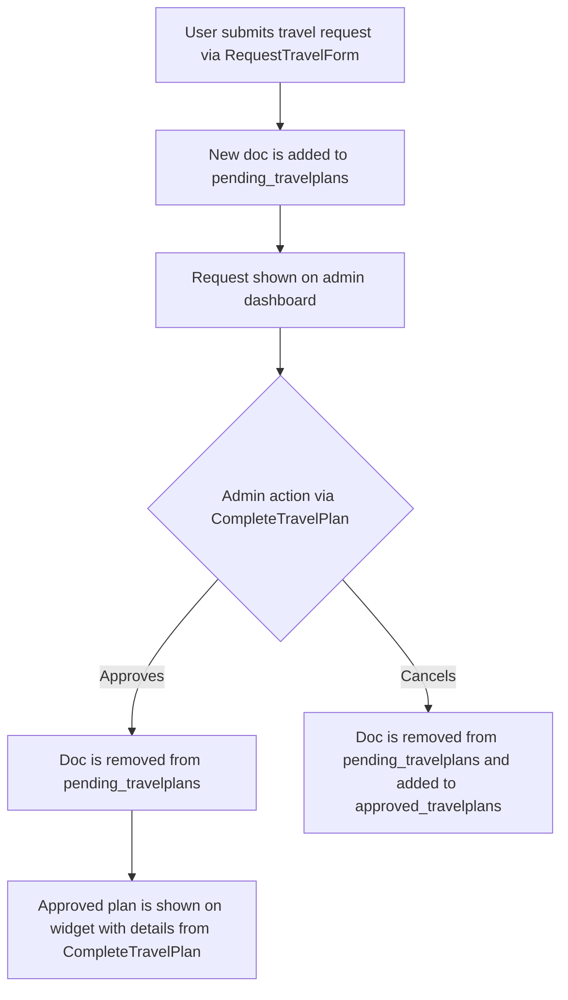
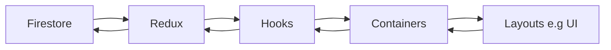

# Travel Plans

## TO DO:

- Make it send an email to a designated admin when travel plans are submitted
- Dialog to show details for what pending plans an individual has (the data is already there)
- Can edit approved plans (in case of incorrect info)
- Can see travel plans in user profile

## Overview

This is a widget where users can:

- Submit requests to travel
- See approved travel plans (And as such where people are going)
- See how many pending travel plans they have

Admins can access a dashboard via the widget to:

- See a list of pending travel plans, fill out technical details and either approve or cancel them.
- See a list of approved plans

Admins cannot

- Edit, approve, or cancel their own plans

## Relevant Files

#### Widgets

- TravelPlansWidget

#### Pages

- travelplans/index

#### Components

- PendingList
- ApprovedList

#### Dialogs

- CompleteTravelPlanForm
- RequestTravelPlanForm

#### Containers

- PendingTravelPlansContainer
- ApprovedTravelPlansContainer
- admin.PendingTravelPlansContainer
- admin.ApprovedTravelPlansContainer
- TravelPlansContainer

#### Hooks

- useTravelPlans (hook)

#### Redux

- travelplans.epics
- travelplans.reducer
- travelplans.selectors
- travelplans.api

## Data flow

Data is stored in two firebase collections.

The flow is:



### travelplans

    Document structure
    ```json
    {
        approvedAt: DATE
        duration: STRING
        email: STRING // used to filter requests to firebase
        purpose: STRING
        workflowId: STRING // used to fetch profile
        travelDetails: {
            reference: STRING
            airline: STRING
        }
        arriving: {
            airport: STRING
            city: STRING
            date: STRING
            time: STRING // hh:mm
        }
        arriving: {
            airport: STRING
            city: STRING
            date: STRING
            time: STRING // hh:mm
        }
        sensitive (subcollection)
            accommodation: {
                name: STRING
                reference: STRING
                url: STRING
            }
    }
    ```

## Security

Security is handled through firestore rules.

- Only `admin`s and `superadmin`s can write.
- Only `admins`s, `superadmin`s and the travelplan's user can view data in the `sensitive` subcollection

Everyone can `read` all travelplans, but an attempt to access the `sensitive` subcollection without the correct permissions will result in the silent failure of retrieving that data. The rest of the collection can still be retrieved.

```js
     match /travelplans/{doc} {
      allow read; //anyone can read non-sensitive info

      allow write: if isAdmin()
      // Subcollection for sensitive data
      match /sensitive/{sensitiveDoc} {
        // Only admins and plan owners can read sensitive data
        allow read: if isAdmin() ||
                      request.auth.token.email == get(/databases/$(database)/documents/travelplans/$(doc)).data.email;
        allow write: if isAdmin();
      }
    }
```

## Notes

:::danger
Travel plans makes use of SSG and hydration for quick updates and live data. If you encounter null issues, this is likely why
:::

:::info



:::
