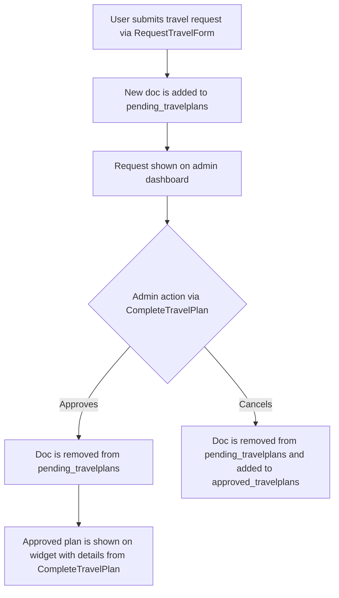
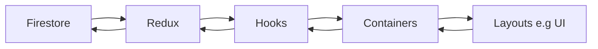

# Travel Plans

## TO DO:

- Make it send an email to a designated admin when travel plans are submitted
- Dialog to show details for what pending plans an individual has (the data is already there)

## Overview

This is a widget where users can:

- Submit requests to travel
- See approved travel plans (And as such where people are going)
- See how many pending travel plans they have 

Admins can access a dashboard via the widget to:

- See a list of pending travel plans, fill out technical details and either approve or cancel them.
- See a list of approved plans

Admins cannot

- Edit, approve, or cancel their own plans

## Relevant Files

#### Widgets
- TravelPlansWidget
#### Pages
- travelplans/index
#### Components
- PendingList
- ApprovedList
#### Dialogs
- CompleteTravelPlanForm
- RequestTravelPlanForm
#### Containers
- PendingTravelPlansContainer
- ApprovedTravelPlansContainer
- admin.PendingTravelPlansContainer
- admin.ApprovedTravelPlansContainer
- TravelPlansContainer
#### Hooks
- useTravelPlans (hook)
#### Redux
- travelplans.epics
- travelplans.reducer
- travelplans.selectors
- travelplans.api

## Data flow

Data is stored in two firebase collections. 

The flow is:



### pending_travelplans

Document structure
```json
{
    createdAt: DATE
    date: STRING ("YYYY-MM-DD")
    destination: STRING
    duration: STRING
    email: STRING // used to filter requests to firebase
    notes: STRING
    purpose: STRING
    workflowId: STRING // used to fetch profile
    preferences: {
        time: STRING
    }
    requires: {
        accommodation: BOOLEAN
        checkin: BOOLEAN
    }
}
```
### approved_travelplans

Document structure
```json
{
    approvedAt: DATE
    flightReference: STRING
    duration: STRING
    email: STRING // used to filter requests to firebase
    purpose: STRING
    workflowId: STRING // used to fetch profile
    arriving: {
        airport: STRING
        city: STRING
        date: STRING
        time: STRING // hh:mm
    }
    arriving: {
        airport: STRING
        city: STRING
        date: STRING
        time: STRING // hh:mm
    }
    accommodation: {
        name: STRING
        reference: STRING
        url: STRING
    }
}
```

## Security

Security is handled through firestore rules. 

- `email` The user's auth email and the doc's email field are used to correctly manage access.
- `custom claims` `admin`s and `superadmin`s can edit, read, and create. But cannot approve their own requests.

```js
    match /pending_travelplans/{doc} {
      // Admins can read all, regular users can only read their own
      allow read: if isAdmin() || resource.data.email == request.auth.token.email;
      allow create; // anyone can create
      allow update, delete: if isAdmin() || resource.data.email != request.auth.token.email; //admins cannot change their own plans
    }
    
    match /approved_travelplans/{doc} {
      allow read; //anyone can read
      allow write: if isAdmin() || resource.data.email != request.auth.token.email; //admins cannot approve their own plans
    }
```

:::warning
You cannot rely on firestore to filter requests for you. If a request violates firestore rules, the **entire** request will fail. Filtering must also occur on the front end in the api.
:::

## Notes

:::danger
Travel plans makes use of SSG and hydration for quick updates and loading. If you encounter null issues, this is likely why
:::

:::info

:::

