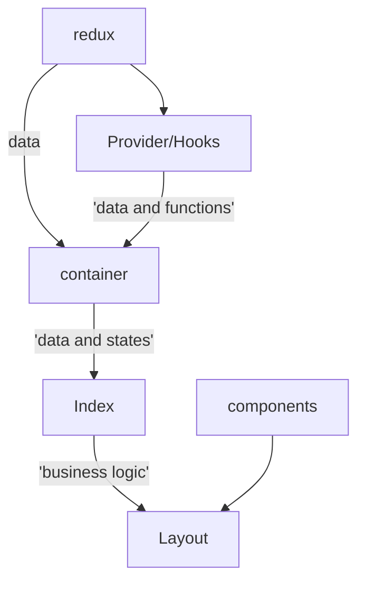

# Overview

There are several design patterns used in the front end of which we will go through

## Pages

Simply, each folder in the Pages directory adds to the url. index.js files are always the root, otherwise you add the filename to the url when searching

e.g

```
Pages/travelplans/index.js -> dashboard.middleware.co.nz/travelplans

Pages/travelplans/admin/index.js -> dashboard.middleware.co.nz/travelplans/admin

Pages/travelplans/admin/approve.js -> dashboard.middleware.co.nz/travelplans/admin/approve
```

In general, it is preferred to have just an index and detail file where possible. However some Pages will need extra directories.

## React design pattern for pages

This design pattern is intended to separate concerns where possible. The larger the page/component, the more strictly this should be adhered to. Of course, with simple pages and components (that have unique functionality), the overhead may not be worth the effort.



:::tip
If the page is very simple, it might not be worth creating a container (assuming that a new one would have to be made). In that case, you can skip the container and use the Index for that purpose.
:::

### Redux

- Retrieves external information
- Stores in state

### Containers

- Retrieves data from the state (redux)
- Retrieves functions and data from providers and hooks
- Handles loading, errors and unauthorised states

### Index

- Retrieves data and functions from containers (And sometimes providers/hooks directly)
- Performs business logic unique to the component

### Providers

- A common state that can be accessed by all components wrapped within
- Acts like a container, but is usable as a function instead of a jsx component.
- examples: The claims provider makes checks for roles simple across the whole app, the widget provider allows for widget data to be accessed and passed between the widget and WidgetFrame (and is per widget, not app wide).

### Hooks

- Something like a controller, a common set of functions used across several components/pages
- Provides one place to edit all instances of a function
- e.g useApprovedTravelPlans provides a common set of functions that interacts with redux (e.g editPlan calls the editApprovedPlan action in redux)

### Layout

- Retrieves data and functions from the Index
- Should be solely responsible for managing the UI of the page (Could independently handle open/close states)
- Should be separate from data/business logic and self-contained.

## Hydration

Ensure that all components are resistant to null values and that custom hooks/providers have loading states. This is because it takes time to retrieve this data, so ensure that there are loading states etc. Furthermore, sometimes redux can remove values in the state as it syncs to firebase (Some firestore syncs can remove values, this shouldn't happen but it does). So make sure that your components are made with this in mind.

## Material UI

Material UI v5 is the component library used for this application. mui.com should have most of the information you need however:

### Wrap _everything_ in MUI

Apart from React.Fragment, wrap everything in MUI for a consistent look.

```js
<Typography>{children}</Typography> /** vs */ {children}
```

If you really need a generic HTML element you can do something like:

```js
<Typography component='div'>{children}</Typography>
<Button LinkComponent={Link /** next.js Link */}>{Children}<Button>
//or
<Button LinkComponent='a'>{Children}<Button>
```

### Styling

- themes: For static changes and common colour values
- styledComponents: For dynamic changes (e.g transitions, hovers)
  e.g

```js
 <TableRow /> /** -> */ <StyledTableRow />
```

- sx: for unique and quick changes

:::warning
Don't use style={} for MUI components. It can cause weird interactions and will override the MUI system.
:::

## Conventions

Here are some common patterns used in the application

### Pages

```js
<App>
  <TemplatePageTitle title="title" breadcrumbs={breadcrumbs} action={actions} />

  <TemplateMain noMobilePadding>{children}</TemplateMain>
</App>
```

### Card

Remember to use the mui card system properly

```js
<Card>
  <CardHeader title="title" subtitle={subtitle} action={action} />
  <CardContent>{Children}</CardContent>
  <CardActions>{Children}</CardActions>
</Card>
```

### Const (Arrow Function) or Function

In all honesty, it's a matter of preference. It could be more readable for utility functions to be a `function` and to send it to the bottom of the file, out of the way. It also makes the purpose of various bits of code more obvious. On the other hand, there are more resources that use const, with plenty of tips and tricks.

:::tip
If using a const is more convenient in your use case, but the function is very long and makes a component hard to read, consider something like

```js
const [valA, setValA] = useState(value);
const x = ({ valB }) => {
  return doX(valB, setValB);
};
// somewhere else in the code
function doX(valB, setValB) {
  /** lots of code */
  setValB(valC);
}
```

:::

#### Const

Use for:

- Components

```js
const Component = () => (/**Do thing*/)
```

- Handlers where convenient

```js
const handlerA = (e) => (/**Do thing*/)
```

#### Function

Use for:

- Utility/Pure functions

```js
function Add(a, b) {
  return a + b;
}
```

### Enums

Enums are your friend. Add them if you have consistent values you need to use across the application.
