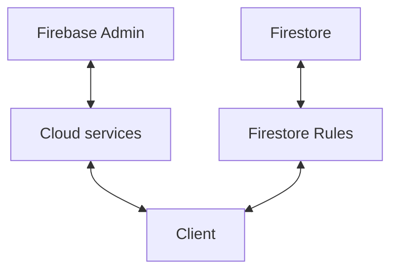
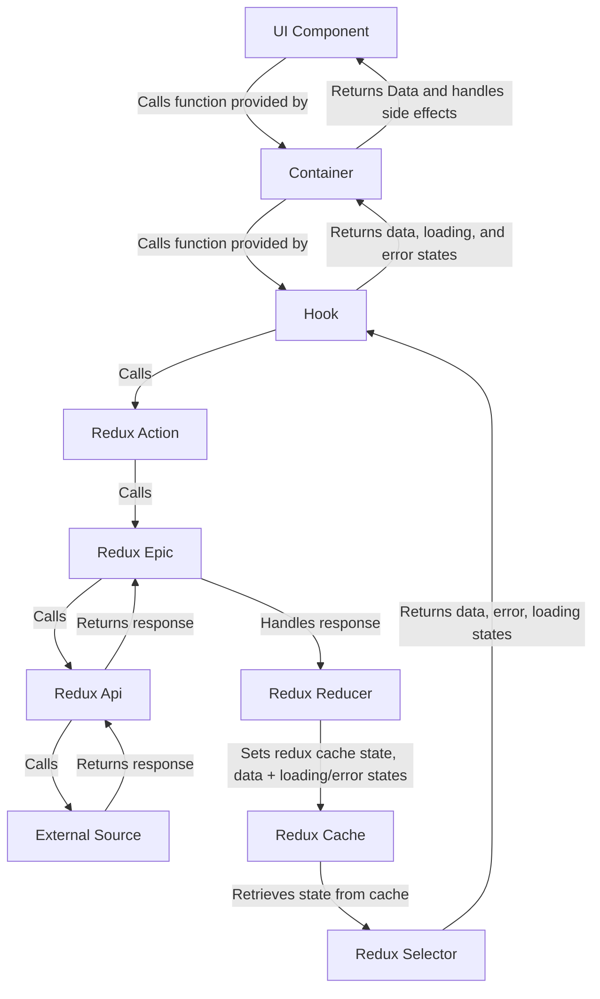

## Intro 

Before we continue, it is important to establish the architecture of this system. 

In this system, the client can directly interfact with the database (Using cloud-side firestore rules to protect data) or with cloud services. It is simplest to think that everything not in the `/functions` directory is client side. 

:::warning
A consequence of this is that anything client side cannot access `firebase-admin` and/or other server-side only utilities.
:::

## Clientside APIs

[Click here](../clientside-data/Overview.md) for more detail. But in summary, this external data can be retrieved via redux which will help handle side-effects like loading, and errors. Or inside a component, though this is not preferred.

The following is the average external api call.

## Security

[Click here](../security/security.md) for more details. But in summary, this app uses google custom claims as its rbac security system. This adds parameters to the jwt token that can be checked. This can be used to restrict access to UI features, or to firestore data.

