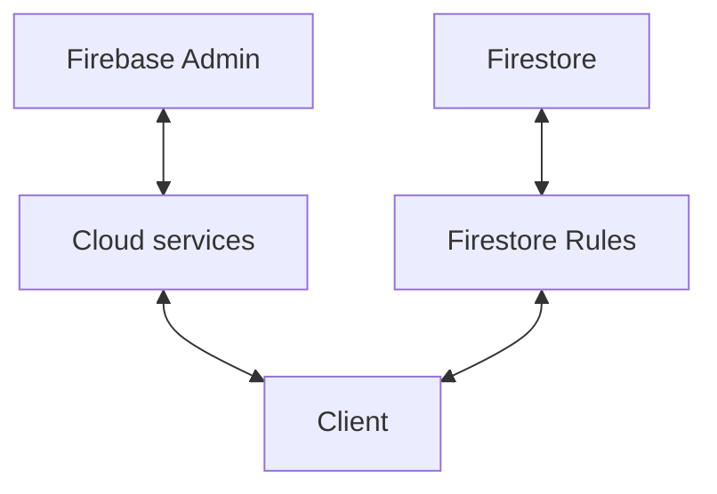
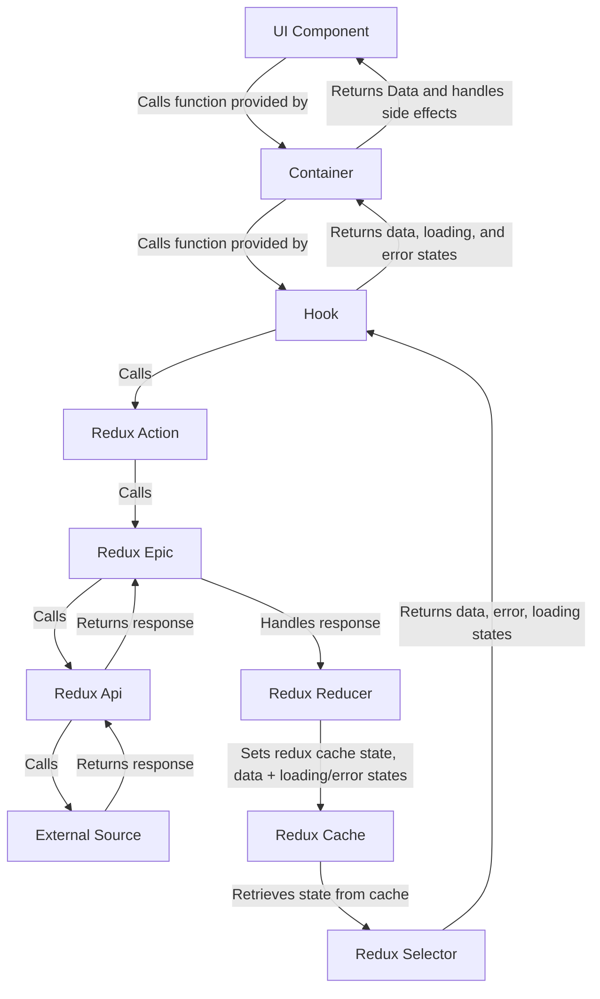

## Intro 

Before we continue, it is important to establish the architecture of this system. 

In this system, the client can directly interact with the database (Using `firestore.rules` to protect data) or with cloud services/functions. It is simplest to of it as anything not in the `/functions` directory being client side. 

:::warning
`/functions` and `root` have separate `package.json` files that need to be installed for local use. They have different dependencies, and available commands.
:::

```mermaid
graph TD;
    A[Firebase Admin] <--> A2;
    A2[Cloud services] <--> 1[Client];
    B[Firestore] <--> B2[Firestore Rules];
    B2[Firestore Rules] <--> 1[Client];
```

## Clientside APIs

[Click here](../clientside-data/Overview.md) for more detail. But in summary, this external data can be retrieved via redux which will help handle side-effects like loading, and errors. Or inside a component, though this is not preferred.

The following is the average external api call.

```mermaid
graph TD;
    A[UI Component] --Calls function provided by--> B[Container];
    B --Returns Data and handles side effects--> A;

    B --Calls function provided by-->C[Hook];
    C --Returns data, loading, and error states--> B;

    C --Calls--> D[Redux Action];
    D --Calls--> E[Redux Epic];
    E --Calls--> F[Redux Api];
    F --Calls--> G[External Source];

    G --Returns response-->F;
    F --Returns response--> E;
    E --Handles response--> R[Redux Reducer];
    R --Sets redux cache state, data + loading/error states--> cache[Redux Cache];
    cache --Retrieves state from cache--> selector[Redux Selector];
    selector --Returns data, error, loading states--> C;
```

## Security

[Click here](../security/security.md) for more details. In summary, this app uses google custom claims as its rbac security system. This adds parameters to the `jwt token` that can be checked, and also called via `firebase admin`, or within `firestore.rules`. This can be used to restrict access to UI features, or to firestore data.

