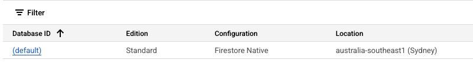

# The Cloud

This dashboard uses firebase, firestore and cloudfunctions as its backend. Apart from providing
important data to the client, data is also synced from various third party sources into collections. 
Often, one collection can have many sources. Thus you will need to be able to access these collections 
to observe and modify data, as well as edit the functions syncing third party sources into
these collections.

:::info
Both cloud functions v1 and cloud run (cloud functions v2) are used in this system. They are both deployed in very different ways.
:::

# Collections

Collections can be accessed in the non-prod firestore console, or by clicking [here](https://console.cloud.google.com/firestore/databases/)
and clicking on the "(default)" link.



From here you can access and observe various collections and the data within. As a quick guide to key collections:

 - **profile**: User data to be displayed throughout the dashboard.
 - **hiring**: User data specific to the /hiring page.
 - **roles**: Read/write permissions (You can re-write yours here if you are having issues).
 - **config**: Static variables that the user may want, but you do not want to expose in client-side code.
 - **clients**: Client data.
 - **jobs**: Job data.
 - **leave-requests-approved**: Approved leave requests from iPayroll.
 - **leave-requests-closed**: Past leave requests from iPayroll.

# Storage

Firebase storage is used as storage buckets for non-noSQL data. It can be accesssed through the firebase 
console or by clicking this link [here](https://console.firebase.google.com/project/mwnz-dashboard-nonprod/storage/)

# Cloud Functions v1

To sync data to these collections we use cloud functions which can be found in the /functions directory in the
dashboard project, or through the cloud functions 1st gen console that you can go to either through the firestore
searchbar or [here](https://console.cloud.google.com/functions)

These functions are not based off the literal functions or file names found in /functions, but on topic names that call
on the functions in the directories. You will also likely want to edit and deploy these functions, this is how it is done:

### Edit

Better practice is to edit it on your local git repo clone. However in a pinch you can click a topic, go to source,
and it the code for that topic there. Mind that this can cause issues if multiple topics use the same function as this
only edits the source code for that one topic.

### Deploy

Deployment is quite simple. First you want to install firebase tools in your root directory by typing the following
in your console

```console
npm i -g firebase-tools
```

and login to your account via 

```
firebase login
```

:::tip
Ensure that your firebase.rc points towards non-prod, and that the package.json under the functions directory is on a version
of node supported by firebase functions.

e.g 

```
  "engines": {
    "node": "18"
  },
```
:::

:::tip
Finally ensure that the source of your functions points towards the function directory in your firebase.json

```
"functions": {
    "source": "functions"
  },
```
:::

Finally you can deploy your edited function! Navigate to your function directory in your console, ensure your
packages are installed, and deploy your functions via topic. 

```console
# Navigate to functions dir
cd functions/
# Install node packages
npm install
# Deploy functions
firebase deploy --only functions:[FUNCTION_NAME_A]
# OR deploy multiple functions
firebase deploy --only functions:[FUNCTION_NAME_A], functions:[FUNCTION_NAME_B]
```

:::danger
DO NOT deploy all functions via
```console
firebase deploy --only functions
```
Ensure you specify function names. This is because updating functions takes awhile (Potentially hours if you're 
looking at all of them) and might update them to a more recent version of node.js. 
:::

:::warning
If you are deploying a function, ensure that all topics using this function are included in the deployment. This might
result in topics overwriting eachother due to having different versions of the same function. 
e.g iPayrollSyncLeaveRequestOnTopic, iPayrollSyncLeaveRequestOnScheduleWeekdayHour, etc etc....
:::

:::tip
To select what is being synced to each field, add the field to the transform function. You can also
look up the service to find their API (Some are more useful than others).
:::

:::warning
If you remove a field from one of the transformers, that data will remain.
:::

:::tip
If you go to the Logs tab, you can see a log of functions deployed. You can see if your functions have had
an affect in the firestore, but updating can take awhile, give it 10 minutes after deployment
:::

# Cloud Run 

Unlike cloud functions, Cloud Run functions are fully containerised, with their own package.json. They contain their own deploy script, and should be excluded in the .gcloudignore as they shouldn't be deployed with the cloud functions.

```console
# cd to function dir
cd /functions/rbac
# register deploy.sh as an executable
chmod +x ./deploy.sh
# run deploy
./deploy.sh
```


 