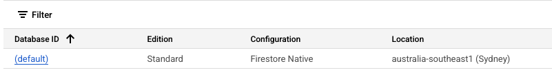

# The Cloud

This dashboard uses firebase, firestore and cloudfunctions/run as its backend.
Data provided to the client is often synced from various third party sources into collections, with one collection able to have multiple sources. As such you will need to be able to access these collections
to observe, modify data, and edit the various functions syncing third party sources to
these collections.

:::info
Both cloud functions v1 and cloud run (cloud functions v2) are used in this system. They and are deployed/set up in different ways.
:::

# Collections

Collections can be accessed in the non-prod firestore console, or by clicking [here](https://console.cloud.google.com/firestore/databases/)
and clicking on the "(default)" link.



From here you can access and observe various collections and the data within. While most collections only contain `documents`, some more complicated collections will contain `sub-collection(s)` within a `document`. [documentation]('https://firebase.google.com/docs/firestore/data-model')

# Storage

Firebase storage is used as storage buckets for S3 data. It can be accesssed through the firebase
console or by clicking this link [here](https://console.firebase.google.com/project/mwnz-dashboard-nonprod/storage/)

# Cloud Functions v1

To sync data to these collections we use cloud functions which can be found in the `/functions` directory in the
dashboard project, or through the cloud functions 1st gen console. You can find this either through the firestore
searchbar or [here](https://console.cloud.google.com/functions)

These functions are defined in a `functions.foo.js` file, and called in an `index` file in the `/functions` directory. The file structure of `/functions` does not matter (Aside from cloud services/jobs due to the custom deployment commands where the directory name is used as an id). You will also likely want to edit and deploy these functions as following:

### Editing

You should edit in a local branch and **not** edit via the `source` tab in the cloud functions UI. Otherwise it can be hard to review what is actually going on within a function.

:::warning
For functions that use `hashing` for detecting changes, remember that it is detecting changes in `incoming` data, it is not comparing it to data *already* in firestore.
:::

### Deploy

Deployment is quite simple. First you want to install firebase tools in your root directory by typing the following
in your console

```console
npm i -g firebase-tools
```

and login to your account via

```
firebase login
```

:::tip
Ensure that your firebase.rc points towards non-prod, and check the version of functions/package.json
:::

Finally you can deploy your edited function! Navigate to your function directory in your console, ensure your
packages are installed, and deploy your functions via topic.

```console
# Navigate to functions dir
cd functions/
# Install node packages
npm install
# Deploy function
npm run deploy:functions:nonprod -- --[FUNCTION_NAME]
# OR deploy multiple functions
npm run deploy:functions:nonprod -- --[FUNCTION_NAME_A] --[FUNCTION_NAME_B]
```

This is just a fancy wrapper in functions/package.json that uses firebase deploy --only functions:[FUNCTION_NAME]

:::danger
DO NOT deploy all functions via firebase deploy (Unless deploying to prod), but if you must:
:::

:::tip
Usually, there is only one function doing actual work despite the similar names. The rest just publish to the pub/sub and do not need to be updated - unless you have made changes to those functions i.e iPayrollSyncLeaveRequestOnTopic vs iPayrollSyncLeaveRequestOnScheduleWeekdayHour
:::

:::tip
If you go to the Logs tab, you can see a log of functions deployed. You can see if your functions have had
an affect in the firestore, most functions run every 10-15 minutes.
:::

### Trigger

If your cloud function uses pub/sub, you can manually trigger cloud functions to ensure that they are working with the following steps

- Select to your v1 cloud function of choice from [the list](https://console.cloud.google.com/functions/list?inv=1&invt=Ab5Ivw&project=mwnz-dashboard-nonprod)
- Go to "Triggers"
- There should be a pub/sub trigger. Select the last part of the topic url e.g projects/mwnz-dashboard-nonprod/topics/employees-ipayroll-sync -> employees-ipayroll-sync 
- Enter and run the following command to your console (Message is required)

Alternatively, you can check the topic used in the `functions.foo.js` file, if it is easier to find.

```sh
gcloud pubsub topics publish ${topic} --message='{"requestedBy":"admin"}'
```

- Done, you should see new information in the cloud function's logs.

# Cloud Run

Unlike cloud functions, Cloud Run functions are fully `containerised`. However, their package.json should only contain metadata, all of its environment should be set by `functions/package.json`.

You can deploy it via:

```console
# Navigate to functions dir
cd functions/
# Install node packages
npm install
# Deploy function
npm run deploy:cloudrun:nonprod -- --[DIRECTORY_NAME]
# OR deploy multiple functions
npm run deploy:cloudrun:nonprod -- --[DIRECTORY_NAME_A] --[DIRECTORY_NAME_B]
```

## These are the required boilerplate files for cloudrun services

You can note that other than the package.json, you can simple copy paste these. `deploy.cloudrun.js` is what connects the root package.json and each cloudrun service. The naming is based on the directory e.g rbac is in the ~/rbac directory and the name is as such `rbac`.

## package.json

```json
{
  "name": "dashboard-functions-rbac",
  "version": "1.0.0",
  "private": true,
  "main": "server.js", <-- what file to launch
  "config": {
    "serviceName": "rbac" <-- helps the cloudbuild.yaml and dockerfile to automatically make decisions based on the correct directory
  },
  "scripts": {
    "start": "node server.js"
  }
}
```

## cloudbuild.yaml

```yaml
steps:
  - name: "gcr.io/cloud-builders/docker"
    args:
      - "build"
      - "-t"
      - "${_IMAGE_NAME}"
      - "-f"
      - "${_SERVICE_DIR}/Dockerfile"
      - "--build-arg"
      - "NODE_VERSION=${_NODE_VERSION}" # <-- acquired from base package.json
      - "--build-arg"
      - "SERVICE_DIR=${_SERVICE_DIR}"
      - "."
images:
  - "${_IMAGE_NAME}"
timeout: "1200s"
```

## Dockerfile

```dockerfile
ARG NODE_VERSION
FROM node:${NODE_VERSION}-slim

# Install curl for healthcheck
RUN apt-get update && apt-get install -y curl && rm -rf /var/lib/apt/lists/*

# Set working directory
WORKDIR /app

# Copy root package files (includes dependencies)
COPY package.json package-lock.json ./

# Install dependencies from root
RUN npm ci --omit=dev

# Copy service metadata first to read serviceName
ARG SERVICE_DIR
COPY ${SERVICE_DIR}/package.json ./service-package.json

# Copy service source files
COPY ${SERVICE_DIR}/ ./

# Expose Cloud Run default port
EXPOSE 8080

# Run as non-root
RUN groupadd -r appuser && useradd -r -g appuser appuser
RUN chown -R appuser:appuser /app
USER appuser

# Healthcheck
HEALTHCHECK --interval=30s --timeout=10s \
  CMD curl -f http://localhost:${PORT:-8080}/health || exit 1

# Start service
CMD ["npm", "start"]
```
