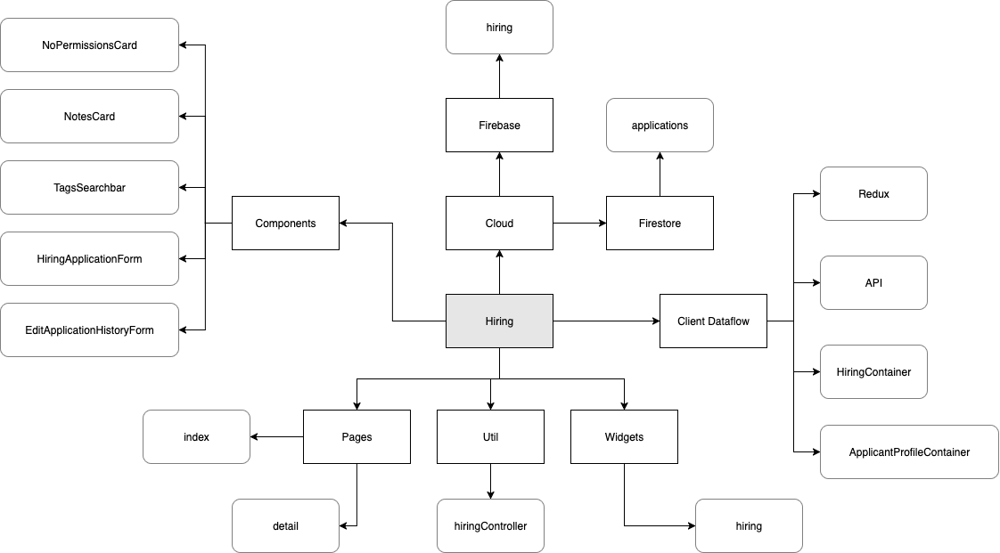

# Hiring Overview

The hiring page acts as a management portal for applications for middleware, recording every step of the process, including post employment. On this page you can:

- `Add` a new applicant and `upload` a cv.

- Progress the applicant from `applied` -> `contacted` -> `interviewed` -> Hired (`Current_Employee`)/`Not_Hired` -> `Past_Employee`.

- Search based on user fields, skills (pulled from cv), application stage.

- `reupload` or `delete` a cv.

- `delete` or `edit` user details and fields such as `external links`.

- `Add` or `edit` notes per user.

## Diagram

Here is a broad overview of the hiring system.

The `UI` displays data from `redux`, which communicates via the `api` to the `firebaseSDK`. 
The `client` can also call the `API` to perform actions such as `adding applicants`, and `editing data`.
`HiringController` is used throughout the `client` as a `utility` to perform complicated actions and ensure consistency through `enums`.

Firebase/store will reject users that lack the required `claim(s)`. 
Otherwise, it will perform the appropriate actions.

## Links

This is a visual representation of the Hiring docs in this documentation base, along with a list of links below.

