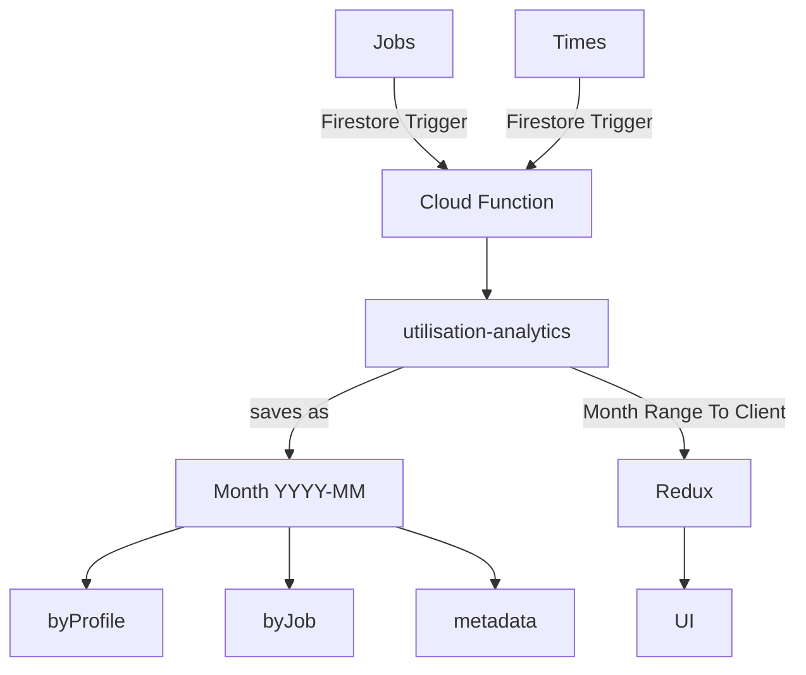

This page is where admins can build queries that process timesheet entries. It uses the utilisation-analytics database which pulls from the job and times collections. This data is used to display the percentage of billable vs non-billable hours by practice, job, and profile.

The following is a graph of the data flow from the sources to the UI

## Data Flow Diagram



:::info
utilisation-analytics is a collection of pre-processed data. This is done by a cloud service as even small month ranges can contain thousands of timesheet entries. This can freeze up the UI, so in absence of SQL, this is the comprimise to maintain performance.

For more detail on the cloud function [Click Here](../../../cloud/Cloud%20Functions/Topics/utilisationanalytics.md)

:::

## Redux

A data stream is formed using a range of two months. There is a selector that creates a byPractice map (Ordered by profile practice) and applies configuration exceptions. This is done in the frontend as profiles are hydrated at this point to maintain freshness in profile data. While this could be synced to the collection via firestore triggers, that would add to the cost and size.

### Profiles

All time entries with a workflowId that matches a user in the redux profiles state will have their details hydrated. Else the given name in the entry will be used.

### Data structure

Once it reaches the table, a byPractice map will look like the following:

```js
[
  {
    practice:STRING
    profiles:[
      {
        name: STRING,
​​​        profileId: STRING,
​​​​        totalByMonth: {
          MONTH:{
            billable: NUM,
  ​​​​​​          nonBillable: NUM,
  ​​​​​​          percentageBillable: NUM,
  ​​​​​​          total: NUM
          }
        },
​​​​        totalHours: {
          billable: NUM,
​​​​​          nonBillable: NUM,
​​​​​          percentageBillable: NUM,
​​​​​          total: NUM
        },
        ​​​​jobs:[
          {
            Client:{
              ID:STRING
              Name:STRING
            },
            name: STRING,
            dueDate: STRING-DATETIME,
​​​​​​            estimatedHours: NUM,
​​​​​​            isCompleted: BOOL,
​​​​​​            jobId: STRING,
            totalByMonth: {...},
            totalHours: {...},
            tasks: [
              {
                taskId: STRING,
                isBillable: BOOL,
                taskInfo: {
                  ID: STRING,
                  Name: STRING,
                },
                totalByMonth: {...},
                totalHours: {...},
              }
            ]
          }
        ]
      }
    ]
  }
]
```

byProfile and byJob are simply this structure rearranged (e.g jobs:[profiles:[]] vs profiles:[jobs:[]])

### Exceptions

There are numerous exceptions in the data that must be made to product the correct result. The Utilisation Analytics map in redux has a `configuration` field that is pulled by the `UtilisationAnalyticsConfigPanel`. `useJobData` has defaults hardcoded into its config which will ignore internal jobs by default, and re-label certain jobs as `billable`.

The user can change this config as required. If new defaults are required, see the `OVERRIDE` constants in `useJobData`.

:::info
These exceptions can include excluding a job in the calculations, excluding practices, re-categorising a job as billable or non-billable, etc.
:::

## Table

The `BillableHoursByMonthTable` Is a table with nested expandable rows that displays a given `byPractice`, `byProfile`, or `byJob` hashmap. There are `parent` and `child` rows as a profile row may display different content based on whether the table is displaying data `byProfile` or `byJob`. Es-lint does not permit this to be done recursively. 

There is also a multi-tier system for dictating what shade of grey a row should be. It is intended to get darker the deeper you go in the nesting. 
