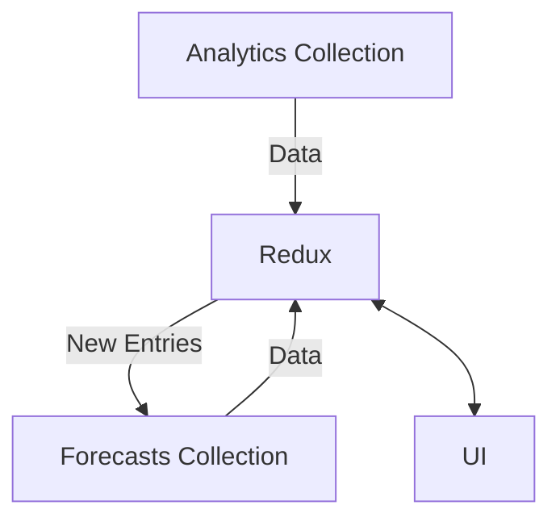

This is a page that pulls from `utilisation-analytics` and `utilisation-forecasts`. It will show the user both the actual numbers of a job, and allow for the input of forecasting per user.

[Click Here](../Utilisation%20Billable/overview.md) to see more details on how `utilisation-analytics` works.

## Data Flow



A current weakness of the system is that at least one month needs to contain actuals data, as timesheets only go to the current date and that is what `utilisation-analytics` is based on.

## Retrieving Forecasting data

A `data stream` is established based on a given `month range`. 

Each `entry` has a compound ID of `workflowId_jobId`. 

```js
MONTH:{
    entries:[
        forecastHours: NUM,
        jobId: STRING,
        monthString: YYYY-MM STRING,
        profileId: STRING
        updatedAt: DATETIME
    ]
}
```

When the `table` is rendered, this data is retrieved per cell via a `selector` provided a valid `month`, `workflowId`, and `jobId`.

## Table

The `ForecastTable` works very similarly to the `BillableHoursByMonthTable`, sharing the parent-child row system. However, this table only displays `billable hours`. To view `non-billable hours` You need to hover over a cell. In child rows, `Forecast Cells` use a special component that either shows an `editable field` or `disabled state` based on whether a job has ended on that month or not.