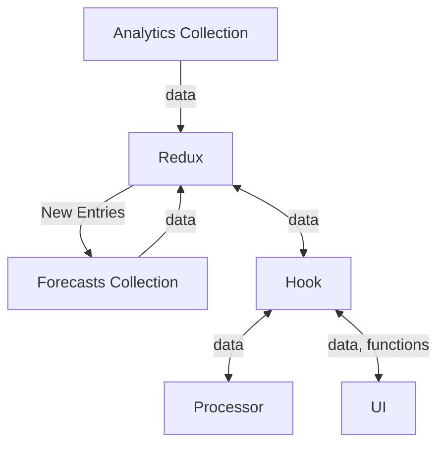

This is a page that pulls from `utilisation-analytics` and `utilisation-forecasts`. It will show the user both the actual hours for a job, and allow for the input of forecasting per user.

This feature is split across two pages, `job-manager forecasting` and `utilisation forecasting`.

`job-manager forecasting` Is only accessible by `job managers` and uses the `restricted` API so that they correctly query the database - which has `firestore rules` that restricts `job managers` to only be able to view data related to jobs they manage.

`utilisation forecasting` Is only accessible by `finance` users and uses the `unrestricted` API that efficiently queries for all jobs.

## Data Flow



## Redux

## Hook: useUtilisation

```mermaid

```

## Processor: utilisationDataProcessor

```mermaid

```

## Layout

## Container

## Table

Both `utilisation forecasting` and `job manager forecasting` pages use the same table. The only difference is that `utilisation forecasting` has `by profile`, `by job`, `override`, and `by practice` buttons while `job manager forecasting` only has the default `by job` view (no button).

As such `utilisation forecasting` doesn't allow entry of forecasting data without explicitly enabling it, while in `job manager forecasting` it is enabled by default and cannot be turned off.

The following is an explanation of the components of the table.

### Main (forecastingTable)

Parameters:

- `data` Processed forecasting and utilisation data to be displayed.
- `startDate` YYYY-MM-DD
- `endDate` YYYY-MM-DD
- `writeForecasts` Function to provide a set of forecast data for writing to the forecasts collection.
- `setViewMode` Function to change view mode.
- `viewMode` Current view mode.
- `actionConfig` What interactable buttons to show.
- `rowConfig` What fields to show in the rows.

Notes:

- This is where the data is sorted in alphabetical order
- This is where UI side-effects of actions (i.e writing forecasts) is handled
- This is where the table state is handled (excepting view mode)

Return: `JSX obj` based on the given `view mode`

### ActionsSection

This handles the interactive buttons (And their side-effects):

- Change the `view mode`
- Save forecasting changes
- Expand/collapse all rows.
- Override cell editability

### TableHeader

This is a `table header` that transforms based on `view mode`. 

:::warning
When adding/subtracting columns, remember to adjust the span compensations to prevent any whitespace from appearing
:::

### Parent Rows

These are the top layer rows that can be expanded to their `child rows`. They show summaries of their objects i.e a job shows a summary of all its assigned profiles. As such, they do not have editable forecast cells, because at this level there are no singular `jobId`-`profileId` pairs.

:::info 
`profile row` is the only exception, as it is a `parent row` that can also be a `child row` to the `practice row`.
:::

#### ParentJobRow

- utilisedPercentage = all time billable hours / estimated hours
- Actuals

#### ParentProfileRow

#### ParentPracticeRow

### Child Rows

#### ChildJobRow

#### ChildProfileRow

### Cells

#### CellWrapper

#### DataCell

#### InputCell

#### PercentageCell

## Notes

### Working Hour Calculations

```
workingHours = (8 * working days in month) - ( 8 * weekends in month) - ( 8 * non-weekend holidays) - ( total leave for month)
```

`workingHours` and `Available` are treated as synonyms (`Available` should be the terminology rendered in the UI)

### Current month

The current month is included under `forecasts`.


