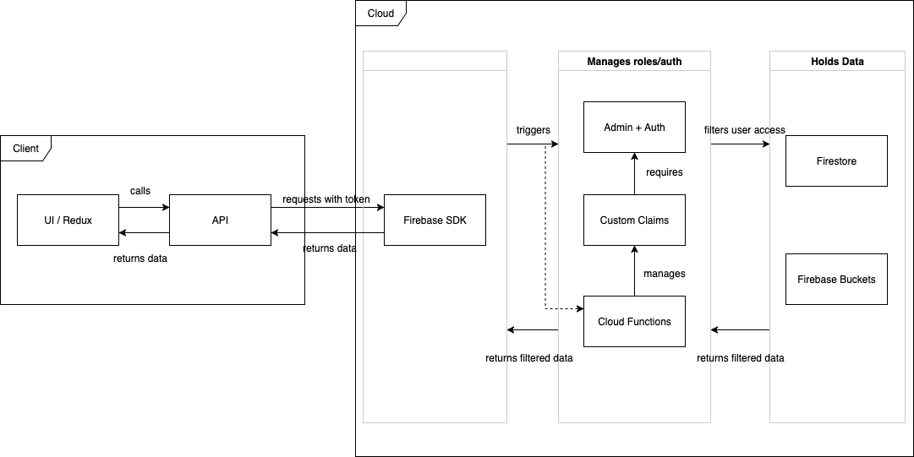
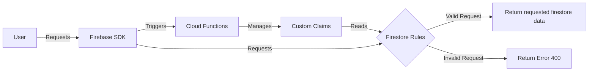

# Custom Claims

[Official Documentation](https://firebase.google.com/docs/auth/admin/custom-claims)

Google custom claims is a convenient way to establish roles on a `firebaseapp`. This is in part because it is conveniently accessible throughout the techstack due to its tight integration with google's system. A prime example is how it piggy backs off firebase-auth, meaning that it is [simple to check and edit custom claims for any authenticated user](./firestore-rules).

## Secure Use of Custom Claims

Before starting on technical implementation, it is imperative to keep two things in mind. 

On the `client` side, `custom claims` is **only** useful for `user experience` and is **not** secure, it **can** be bypassed. That is to say, it is useful for ensuring that users don't get confused when, say, clicking a `button` their `role` cannot interact with fails. Always assume that a user can bypass anything `hidden` on the `client` and/or directly send requests to the `firebaseSDK`.

On the `cloud` side, **only** trust firebase's copy of `custom claims` and **never** trust the user provided data. This is available via the firebase `adminSDK`, which also provides a method to verify the user's `jwt token`. The actual `security` that `custom claims` provides is in establishing `firestore rules`. These cause any `request` that violates a rule (i.e Only users with an `admin` custom claim can read the `foo` collection) to fail.

By combining both you gain the `user experience` benefits in the client, and the `security` benefits on the cloud. A user should not be able to access `features` their role isn't permitted to via the `dashboard`. If they do, the `UI` should warn them they lack access. If they try to access or alter the `data` anyways, it should fail as their role(s) lack the `read`/`write` access to that feature.

## Overview

The following is a loose interpretation of a UML diagram describing the system.

It is rather difficult to summarise it all in one image as the way it is handled differs based on the use case. In general: Cloud functions are only used to change custom claims, the user is given a JWT token on login that they can use to access their custom claims, the data layer is filtered based on `security rules` which checks for `customClaims` in the user's `auth`.

Client side, the `user` checks their `auth token` for `customClaims` and changes the `UI` based on that. While this can be bypassed via editing the `state`, it is ok because firebase is checking it against its own version, not the `users` version.

The following is a simplified diagram of how custom claims is managed and restricts data access based on user requests.

## Adding new roles

Adding new roles is simple and is done as following:

- [ ] Add new role to CLAIMS map in `functions/rbac/utils/consts.js` *and* `src/redux/rbac/rbac.consts.js`
  - These must be THE SAME
- [ ] Redeploy RBAC service in **both** prod and non-prod via `npm run deploy:cloudrun:[prod/nonprod] -- --rbac`

