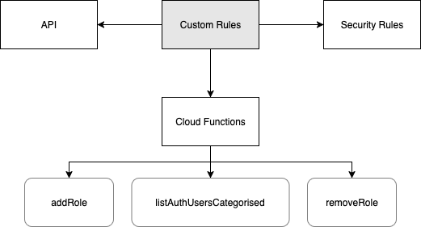

# Custom Claims

[Official Documentation](https://firebase.google.com/docs/auth/admin/custom-claims)

Google custom claims is a convenient way to establish roles on a firebaseapp. This is in part because it is conveniently accessible throughout the techstack due to its tight integration with google's system. A prime example is how it piggy backs off firebase-auth, meaning that it is [simple to check and edit custom claims for any authenticated user](./firebase-security-rules).

## Secure Use of Custom Claims

Before starting on technical implementation, it is imperative to keep two things in mind. 

On the `client` side, `custom claims` is **only** useful for `user experience` and is **not** secure, it **can** be bypassed. That is, it is useful for ensuring that users don't get confused when say clicking a `button` their `role` isn't allowed to interact with doesn't work. Always assume that the user can bypass any `UI` `hidden` on the `client` and directly send information to the `firebaseSDK`.

On the `cloud` side, **only** trust firebase's copy of `custom claims` and **never** trust the user provided data. This is available via the firebase `adminSDK`. The actual `security` that `custom claims` provides is in establishing `security rules`. These `filter` user read/write access based on firebases' stored `custom claims`. 

By combining both you gain the `user experience` benefits in the client, and the `security` benefits on the cloud. A user should not be able to access `features` their role isn't permitted to via the `UI`. If they do, the `UI` should warn them they lack access. If they try to access or alter the `data` anyways, it should fail as their role(s) lack the `read`/`write` access to that feature.

## Overview

The following is a loose interpretation of a UML diagram describing the system.

It is rather difficult to summarise it all in one image as the way it is handled differs based on the use case. In general: Cloud functions are only used to change custom claims, the user is given a JWT token on login that they can use to access their custom claims, the data layer is filtered based on `security rules` which checks for `customClaims` in the user's `auth`.

Client side, the `user` checks their `auth token` for `customClaims` and changes the `UI` based on that. While this can be bypassed via editing the `state`, it is ok because firebase is checking it against its own version, not the `users` version.

## Roles

**N/A:** A user with no roles is unassigned. They can access anything that isn't role protected (Team list, Team leave list). Remember that these membered are still authorised to be on the dashboard. 

**Operations:** This user can access all features that involve operations. Jobs, Reports, Projects, Clients, Summaries.

**Consultants:** This user can access Jobs, but only see their own jobs.

**Leads/Directors:** They can additionally access the leads and hiring features.

**Admins:** Admins have full access to the system and is a necessary role to perform administrative functions, such as changing others' custom claims.

## Links

The following is a diagram of custom roles docs in this documentation.

  

    #### Cloud Functions:
    - [addRole](../cloud/cloud-functions/custom-rules/add-role.md)
    - [removeRole](../cloud/cloud-functions/custom-rules/remove-role.md)
    - [listAuthUsersCategorised](../cloud/cloud-functions/custom-rules/list-auth-users-categorised.md)
  

  
  

    #### Security Rules:
    - [Security Rules](./firebase-security-rules.md)

    #### API:
    - [Custom Claims](../client-dataflow/custom-claims/custom-claims-api.md)
  

