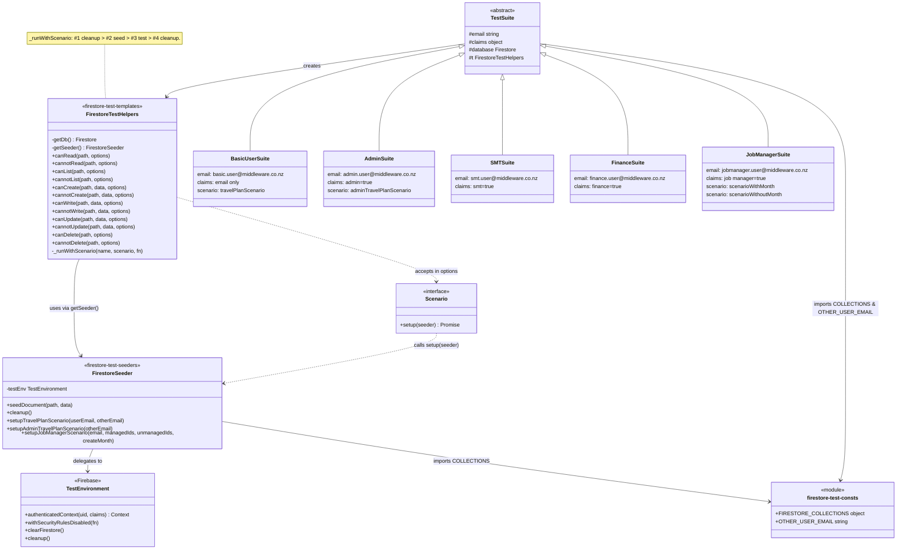

The main ethos behind this testing system is that each test is completely isolated in execution, though they are grouped by role, then collection. This is done by the following:

 - **Test functions are standardised and are defined in the utils class.** 
     - Every read function is the same. There can be overrides in descriptions where extra clarification is required
 - **If tests need seeded data, a fresh database is provided and documents are seeded according to a given scenario** 
     - So tests cannot "share" a database. The database data is controlled by the seeder.

Thus the testing suite as a whole can be thought of as:

- **rules.test** Orchestrator and executor
- **seeder** Database manager
- **utils** Standard test template provider

